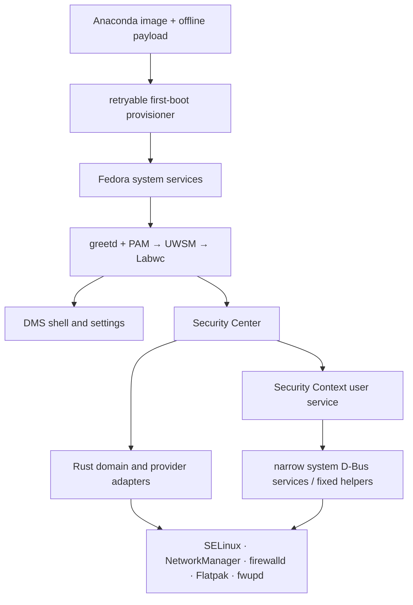

# GREYWARD architecture

## System boundary

GREYWARD composes a Fedora 44 system rather than replacing Fedora's core
services. The installed definition is `environment/production/`; development
VM tooling is an overlay and is not part of the product.

## Major layers

| Layer | Source of truth | GREYWARD role |
|---|---|---|
| Fedora foundation | RPM database and upstream services | Selects packages, defaults, hardening policy, and integration |
| Image | `environment/image/` plus staged artifacts | Builds Anaconda media with verified offline RPM/Flatpak payloads and provenance manifests |
| Production system | `environment/production/` | Owns installed package contract, provisioning, first boot, acceptance, crypto/audit policy, and service enablement |
| Session | greetd/PAM, UWSM, Labwc | Supplies login and the canonical Wayland session; Hyprland is an explicit fallback |
| Shell | pinned DankMaterialShell | Owns panel, launcher, notifications, greeter, general settings, and Polkit-agent UI |
| Security Center | Tauri frontend and Rust workspace | Presents posture and invokes named operations; it is never run as root |
| Security Context | Python user/system services | Normalizes local events, retains bounded history, reconciles selected policy, and bridges fixed privileged operations |
| Packaging | RPM specs and installed-file contract | Separates branding, Security Center, and Security Context ownership |
| Recovery | Btrfs and Restic | Creates local pre-change points and user-configured external backups; these solve different failure classes |

## Why a distribution?

The present distribution boundary lets GREYWARD test a coherent result:

- the session, shell, login, lock/idle behavior, visual identity, and security
  surfaces are installed together;
- security defaults and their provider packages are part of the image contract;
- first boot can verify the installed system before releasing graphical login;
- updates, recovery points, backups, and policy share known service boundaries;
- cross-component behavior such as VPN-aware DNS can be tested as a system;
- packaging and image manifests can trace what entered an installed build.

This does not prove every component must remain distribution-specific. Security
Center, Security Context, themes, or helpers may become standalone packages or
move upstream. Some custom code may be better deleted in favor of an upstream
mechanism. The case for a dedicated distribution should be re-evaluated as the
architecture and real-world use develop.

## Authority and reconciliation

| Subsystem | Authority/source of truth | Observer/derived state | Policy owner and mutation path | Restart, drift, and failure behavior |
|---|---|---|---|---|
| Login/session | Fedora PAM, greetd, UWSM, Labwc | first-boot and production acceptance checks | provisioner installs fixed configuration; user selects a packaged session | first boot keeps greetd gated until provisioning/acceptance succeeds; later service failure remains visible through systemd |
| Shell/settings | DMS configuration and system defaults | DMS runtime | DMS owns general settings; GREYWARD patches and seeds bounded defaults | migration preserves established user settings where defined; DMS failure does not transfer authority to Security Center |
| Host firewall | firewalld/nftables | Rust adapter reads active zone and connection association | upstream NetworkManager/firewalld APIs with upstream Polkit | mutation is re-read; disagreement or unavailable provider is not reported as success |
| Connection/VPN | NetworkManager | network adapters and Security Context derive active link, type, trust, and VPN DNS | NetworkManager profiles remain authoritative | reconnect/restart causes a new read; cached connection state is not authorization |
| Application network control | OpenSnitch daemon | GREYWARD control plane produces bounded activity/rule projection | `OpenSnitchPolicy1` validates and atomically writes GREYWARD policy; daemon mediates connections | stale heartbeat is distinguished from failed liveness; policy saves are not claimed as live until observed |
| Resolver policy | NetworkManager connection metadata and systemd-resolved link state | `SecureDns1` derives owner, transport, provider, and VPN state | root reconciler mutates one unambiguous non-VPN link through resolve1 | VPN ownership wins; managed state is snapshotted and restored on fallback/exit; ambiguity degrades instead of editing global resolver files |
| Flatpak access | Flatpak manifests/overrides and portal stores | Rust derives effective categories after overrides | Flatpak/portal APIs remain authoritative | unsupported schemas remain read-only; result is verified after mutation |
| File scanning | ClamAV engine/definitions and File Security database | user service exposes bounded progress/detections | root `ClamAvScan1` performs closed scans; user process performs prepared quarantine/restore with hash verification | timeout/failure remains explicit; a clean signature result is never treated as proof of safety |
| Updates | DNF5, system Flatpak, fwupd, freshclam | Update Center aggregates independent provider states | user provider runs unprivileged; fixed `greyward-update-action` handles reviewed privileged plan via Polkit | providers can succeed/fail independently; DNF5 uses native offline update; state is re-read after actions |
| Devices | USBGuard and kernel device data | bounded inventory/history | upstream USBGuard owns authorization policy | absence, stopped service, and unknown device state remain distinct |
| Recovery/backup | Btrfs filesystem and Restic repository | Security Center reads helper output | fixed Polkit recovery helper; Restic runs for user-selected repository | recovery point is not a backup; verification failure remains explicit and restore does not imply system rollback |

### Networking ownership

NetworkManager owns connection and VPN lifecycle. firewalld/nftables owns host
filtering. OpenSnitch owns per-application connection mediation. systemd-resolved
owns effective link DNS. GREYWARD services observe and reconcile those
authorities; Security Center is the user-facing controller.

When they disagree, GREYWARD should prefer the authoritative provider and show
degraded/unknown state. It must not merge stale observations into a synthetic
success. The current code has explicit liveness and freshness handling, but
complex reconnect, split-DNS, multiple-VPN, and provider-restart sequences need
broader runtime testing.

## State and data flow

Rust adapters collect bounded facts concurrently and the domain crate evaluates
typed checks. Evidence records source, version, sensitivity, display policy,
observation time, and freshness. Security Context maintains separate bounded
local projections for shell notifications, network activity, device/privacy
events, and update/file workflows. The UI escapes evidence and renders named
states; it does not execute provider commands supplied by data.

## Security policy

- Fedora SELinux remains enforcing and is the primary mandatory-access-control
  mechanism.
- `DEFAULT:GREYWARD` layers explicit cryptographic removals over Fedora's
  DEFAULT policy; see [crypto policy](docs/security/crypto-policy.md).
- auditd records selected identity, authorization, module, and installer
  activity without enabling all-process or all-network auditing.
- root services use systemd sandboxing and bounded writable paths.
- privileged interfaces are inventoried in
  [the privilege model](docs/security/privilege-model.md).

## Known architectural questions

- group-gated D-Bus mutation versus per-action Polkit authorization;
- long-term authority for application network policy;
- whether the Python user service has accumulated too many interfaces;
- failure semantics across partially successful multi-provider updates;
- recovery guarantees for non-Btrfs layouts and firmware failures;
- which integrations should move upstream or become independent packages.
