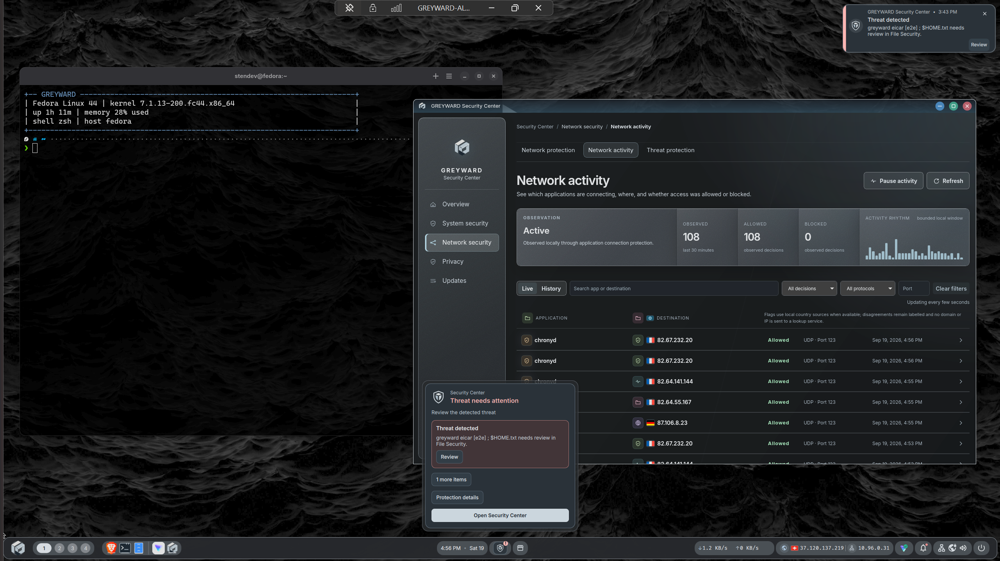
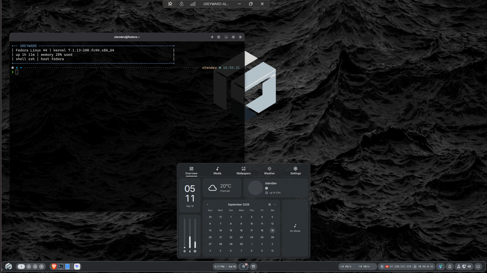
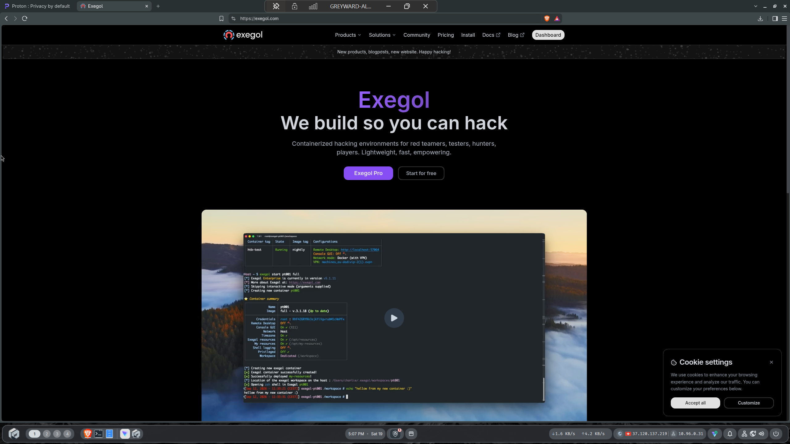
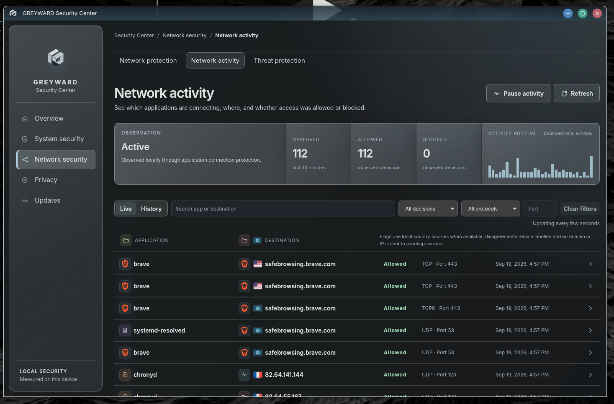
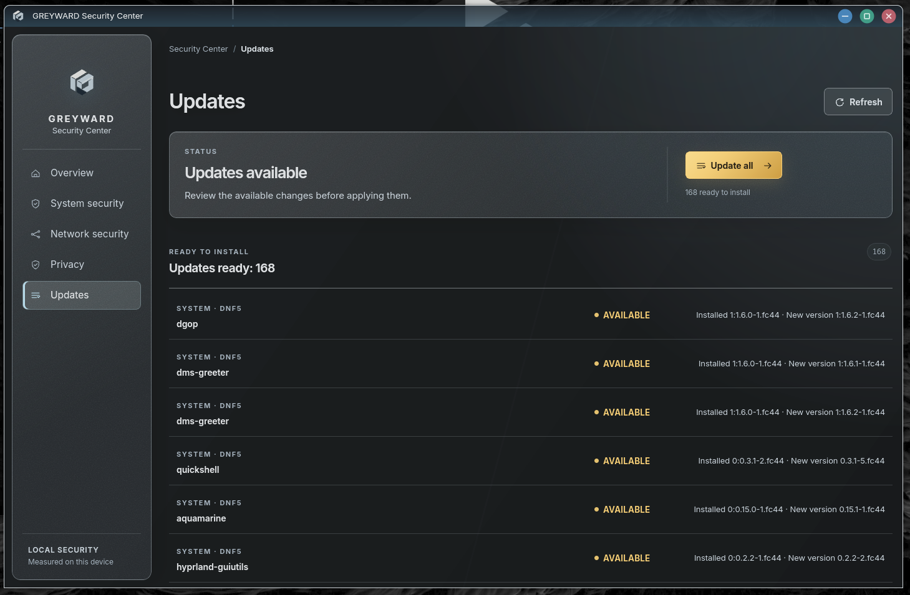
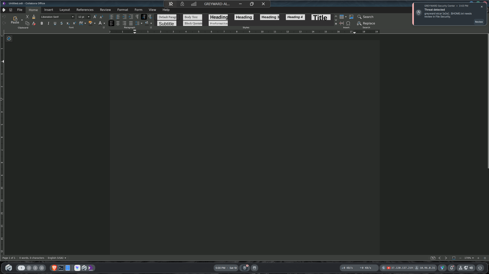

<p align="center">
  
</p>

<h1 align="center">GREYWARD</h1>

<p align="center">
  <strong>A security-focused Linux distribution trying to make stronger defaults livable.</strong>
</p>

<p align="center">
  
  
  
  
</p>

<p align="center">
  <sub>Fedora 44 · Labwc · DankMaterialShell · Tauri 2 · Rust · Python</sub>
</p>

<p align="center">
  <a href="https://sourceforge.net/projects/greyward/files/v0.1.0-alpha.1/">
    
  </a>
</p>

<p align="center">
  <a href="INSTALL.md">Install & test</a>
  ·
  <a href="HARDWARE_TESTING.md">Hardware testing</a>
  ·
  <a href="CONTRIBUTING.md">Contribution guide</a>
</p>

<p align="center">
  <a href="#why-greyward">Why GREYWARD?</a>
  ·
  <a href="#security-direction">Security</a>
  ·
  <a href="#a-desktop-of-its-own">Desktop</a>
  ·
  <a href="#contribute">Why contribute?</a>
  ·
  <a href="#ai-disclosure">AI disclosure</a>
</p>

<br>

<p align="center">
  
</p>

---

GREYWARD is an experimental Linux distribution built around a difficult compromise:

**raise the default security posture of a general-purpose desktop without making it miserable to use.**

It combines opinionated system policy, a distinct desktop environment, first-party security tooling, recovery workflows and tighter integration between security mechanisms that normally live in separate parts of Linux.

The goal is a machine you can eventually daily-drive without first becoming its security administrator.

GREYWARD is **not there yet**. It is pre-release, still rough in places, and some workflows carry more friction than a conventional Fedora installation.

That is also why it is public now.

> [!WARNING]
> GREYWARD is not yet a mature hardened distribution. Do not rely on its security properties without independent validation.

---

# Why GREYWARD?

Linux already has more distributions than any ecosystem has a reasonable excuse for.

So GREYWARD should have to justify becoming another one.

The current thesis is that there is room for a general-purpose desktop where:

* stronger security policy is part of the default system;
* compatibility matters, but does not automatically override security;
* exceptions are narrow instead of globally weakening protections;
* security state is visible and understandable;
* the desktop, system policy and security tooling are designed as one environment.

GREYWARD also has a strong visual direction. The desktop experience is part of the project, not something added after the security work.

Today, some GREYWARD components could probably exist independently.

As the project grows, deeper integration may make the distribution model more important: image construction, session behaviour, recovery, policy, security services, future isolation features and the assumptions between them are easier to reason about when they are built and tested as one system.

But that premise is open to challenge.

Maybe some parts belong upstream.

Maybe some should become standalone projects.

Maybe GREYWARD needs additional ideas before it truly earns its reason to exist.

**The project should discover that through use and scrutiny, not assume the answer in advance.**

---

# Security direction

GREYWARD is trying to provide a strong security foundation by default rather than expecting every user to assemble one manually.

Current work covers areas such as:

`network policy`
·
`DNS`
·
`application access`
·
`cryptography`
·
`Flatpak permissions`
·
`removable devices`
·
`storage encryption`
·
`privilege boundaries`
·
`updates`
·
`file scanning`
·
`recovery`
·
`backups`

The long-term ambition is much higher than the current implementation.

GREYWARD should eventually be able to reason about threats from increasingly capable adversaries, including highly resourced attackers and, ultimately, state-level threats.

**That is a direction, not a current claim.**

GREYWARD today is nowhere near having the maturity, audit history, hardware control or engineering depth required to make that promise.

The point is to build toward stronger security properties incrementally, expose what is actually implemented, and avoid claiming more than can be demonstrated.

---

## Security has a usability cost

Some stronger defaults will break things.

That is not automatically a reason to remove them.

The challenge is deciding whether the security benefit justifies the friction.

GREYWARD is opinionated, but it is still your computer.

The terminal is not hidden. The underlying system remains accessible. Advanced users can inspect, modify or replace policy.

The goal is not to prevent the owner from changing the machine.

It is to give the machine a stronger starting point.

A protection that breaks normal workflows for negligible gain should be challenged.

A protection with a meaningful benefit may be worth some inconvenience.

Finding that boundary is part of the project.

---

## Security gets interesting when things interact

Individual controls are often the easy part.

Their interactions are harder.

For example, GREYWARD can restrict direct DNS traffic to reduce resolver bypass.

Then a VPN connects and legitimately introduces another DNS server.

Block it blindly and the VPN breaks.

Allow DNS globally and the original restriction becomes decorative.

The current approach derives narrowly scoped allowances from active network state.

The interesting question is therefore not only:

> Is DNS protection enabled?

It is:

> What does that policy still guarantee when the rest of the system changes?

The same problem appears around application permissions, firewall rules, VPNs, removable devices, updates, recovery and system evidence.

---

# A desktop of its own

GREYWARD is meant to feel like GREYWARD.

Its shell, system surfaces, Security Center, notifications, settings and interaction patterns share a deliberate visual direction.

| Desktop overview | Everyday application use |
| :---: | :---: |
|  |  |

The current language is dark, restrained and metallic: graphite surfaces, silver accents, controlled transparency and relatively low visual noise.

It will not appeal to everyone.

It does not need to.

The important part is coherence.

UI and UX contributions are very welcome when they improve the experience while respecting the overall visual direction.

I am doing my best with it. Better ideas are welcome.

| Layer                  | Current implementation                              |
| ---------------------- | --------------------------------------------------- |
| **Foundation**         | Fedora 44                                           |
| **Compositor**         | Labwc                                               |
| **Session**            | UWSM-managed Wayland                                |
| **Shell**              | DankMaterialShell adapted for GREYWARD              |
| **Security interface** | GREYWARD Security Center                            |
| **Visual system**      | GREYWARD branding, assets and interaction direction |

The desktop is still evolving. Accessibility, consistency, multi-display behaviour and everyday friction all need work.

---

# Security Center

Security Center exposes the system's security state without pretending uncertainty does not exist.

| Network Activity | Unified updates |
| :---: | :---: |
|  |  |

| Area             | Current integration                                                       |
| ---------------- | ------------------------------------------------------------------------- |
| **System**       | SELinux, Secure Boot, LUKS, TPM, firmware and recovery state              |
| **Network**      | OpenSnitch, firewalld, NetworkManager, managed DNS and VPN-aware policy   |
| **Applications** | Flatpak permissions, overrides, portals and application access            |
| **Files**        | ClamAV scanning, detections, quarantine/restore, provenance and Safe Open |
| **Updates**      | DNF5, Flatpak, fwupd and ClamAV databases                                 |
| **Devices**      | USBGuard and device history                                               |
| **Recovery**     | Btrfs recovery points and Restic backup/restore                           |

<p align="center">
  
</p>

<p align="center"><sub>Security notifications remain visible across ordinary desktop workflows.</sub></p>

Its posture model distinguishes:

```text
SECURE
PROTECTED
REVIEW_NEEDED
ACTION_REQUIRED
UNKNOWN
UNAVAILABLE
NOT_APPLICABLE
```

A failed collector should not become a green checkmark.

An unsupported capability should not automatically become a failure.

Evidence carries provenance, freshness and applicability.

---

# Open development

GREYWARD is free and open source partly because its assumptions should be exposed to scrutiny.

If something is weak, people should be able to show exactly where it is weak.

If the architecture is wrong, it should be challenged.

If something is poorly implemented but worth keeping, it can be improved.

If an idea is simply bad, it should be possible to demonstrate that too.

Architecture decisions are not sacred.

The code being public is not evidence that it is good.

It is an opportunity to make that question answerable.

---

# Contribute

GREYWARD is currently a one-person project.

I am **not a professional software developer or security researcher**.

There will be code that can be simpler, Linux mechanisms I missed, assumptions that fail on real hardware and architectural decisions that deserve to be reconsidered.

That is exactly the kind of contribution I want.

Useful contributions can begin with:

> This can be done much more cleanly.

> This security assumption is wrong.

> Linux already solves this.

> This breaks on my hardware.

> This UI works, but it can be substantially better.

> This protection costs too much usability for what it provides.

A contribution does not need to make GREYWARD larger.

Deleting unnecessary code or replacing a custom subsystem with a better upstream mechanism may be more valuable.

Particularly useful expertise includes:

* Linux/Fedora internals;
* SELinux, Polkit, NetworkManager and nftables/firewalld;
* security architecture and threat modelling;
* Rust and Tauri;
* Wayland, desktop engineering and UX;
* accessibility;
* packaging and image construction;
* real hardware testing.

**Try it. Break it. Question it. Improve it.**

See [`CONTRIBUTING.md`](CONTRIBUTING.md).

Security reports should follow [`SECURITY.md`](SECURITY.md).

---

# AI disclosure

Most of GREYWARD's code has been written with **AI coding agents**.

I am not a coder, and I do not want the repository to imply otherwise.

AI is used to turn system behaviour, product ideas, debugging results and implementation goals into working code.

Changes are tested and iterated against the real system, but this is not equivalent to experienced human engineering or security review.

That makes external review especially valuable.

There will almost certainly be places where an experienced developer immediately sees a cleaner implementation.

Good.

**AI helps build GREYWARD. Open review is how it can become more robust.**

---

# Current state

GREYWARD is in **pre-release alpha/beta development**.

Major components are already implemented, including the desktop/session, image pipeline, Security Center, network/application controls, updates, file-security workflows, device controls and recovery tooling.

Current priorities include:

* sustained bare-metal use;
* broader hardware coverage;
* VPN and network edge cases;
* installer and update recovery;
* suspend/resume;
* accessibility and multi-display behaviour;
* reducing unnecessary friction;
* code and security review.

Bugs found on real hardware will need to be fixed. There is no clever philosophy that substitutes for that unfortunately.

> [!NOTE]
> Screenshots show real GREYWARD development builds. Visual completeness should not be confused with security maturity.

---

# Repository

```text
GREYWARD/
├── environment/        # production system, image and session
├── security-center/    # application, backend, services and tests
├── packaging/          # RPM definitions
├── branding/           # identity and system assets
├── tests/              # validation
└── tools/              # development tooling
```

Repository validation:

```powershell
pwsh -NoProfile -File .\tests\static.ps1
pwsh -NoProfile -File .\tools\validate-repository.ps1
```

Security Center:

```bash
cd security-center
cargo fmt --all -- --check
cargo test --workspace --locked
cargo clippy --workspace --all-targets --locked -- -D warnings
node --test tauri/frontend/ux-contract.test.mjs
```

Technical references: [install & test](INSTALL.md) ·
[architecture](ARCHITECTURE.md) ·
[threat model](THREAT_MODEL.md) · [testing](TESTING.md) ·
[hardware testing](HARDWARE_TESTING.md) ·
[privilege model](docs/security/privilege-model.md)

---

# Licensing

GREYWARD-authored **source code and documentation** are licensed under [`GPL-3.0-only`](LICENSE), except where explicitly stated otherwise.

Third-party software and assets retain their respective licences. See [`THIRD_PARTY_NOTICES.md`](THIRD_PARTY_NOTICES.md).

The **GREYWARD and MANTIS SYSTEMS names, logos, visual identity and designated branding assets are not licensed for general reuse under GPL solely because they are stored in this repository**.

See [`LICENSING.md`](LICENSING.md) for branding and naming terms.

---

<p align="center">
  <sub>
    Stronger defaults · Visible security · Distinct desktop · Open to challenge
  </sub>
</p>
