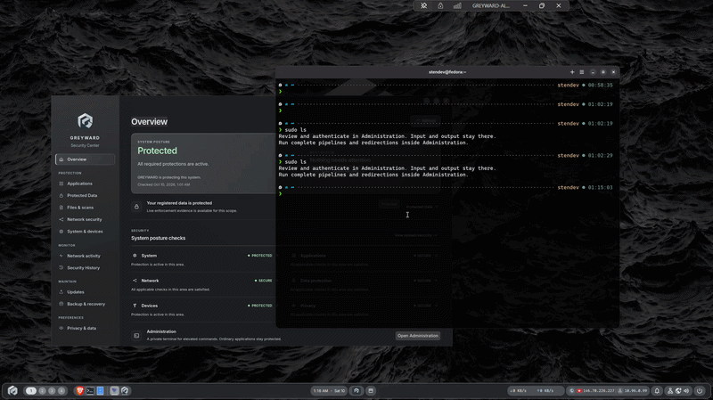
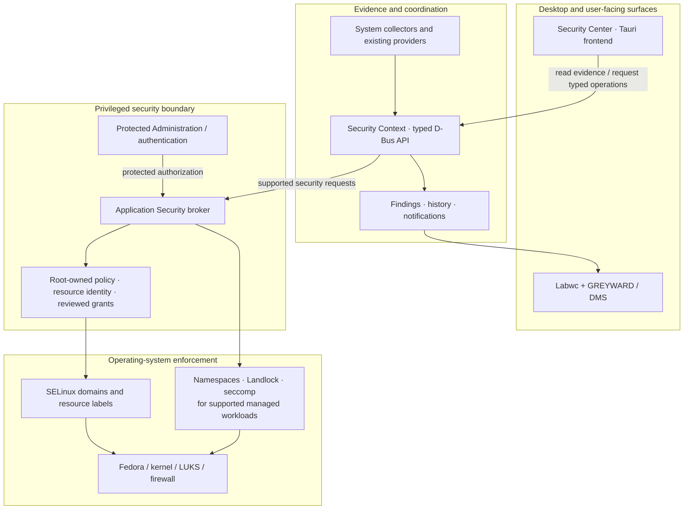
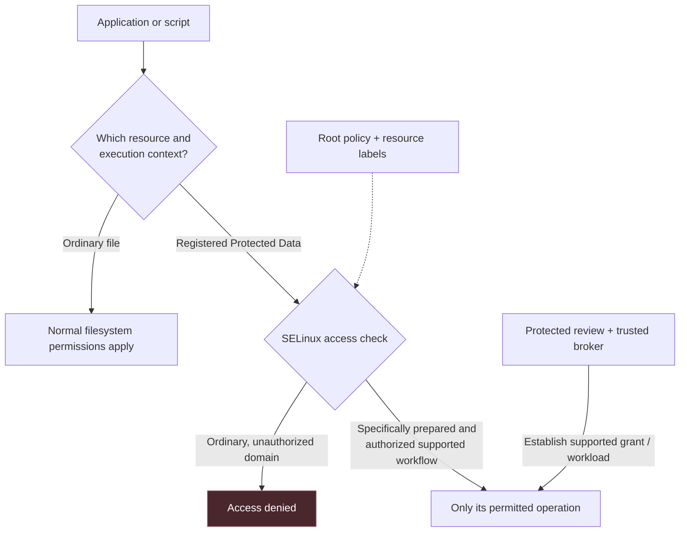
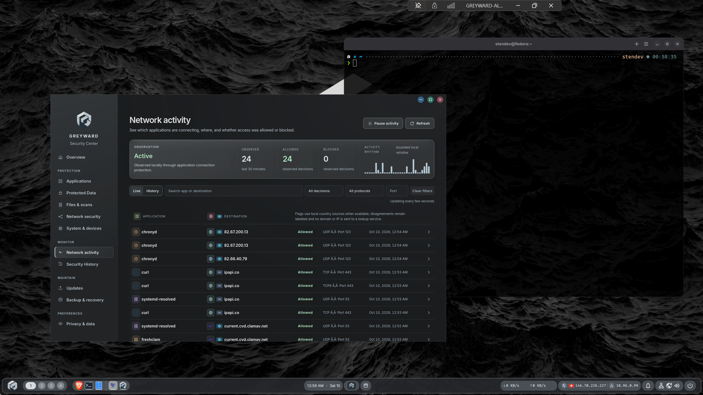
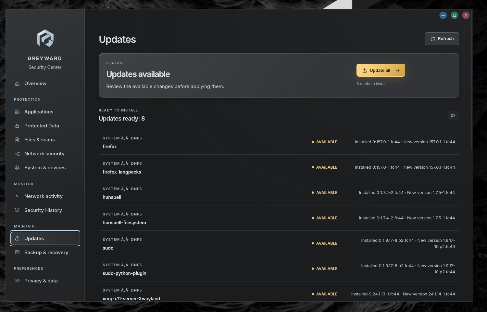
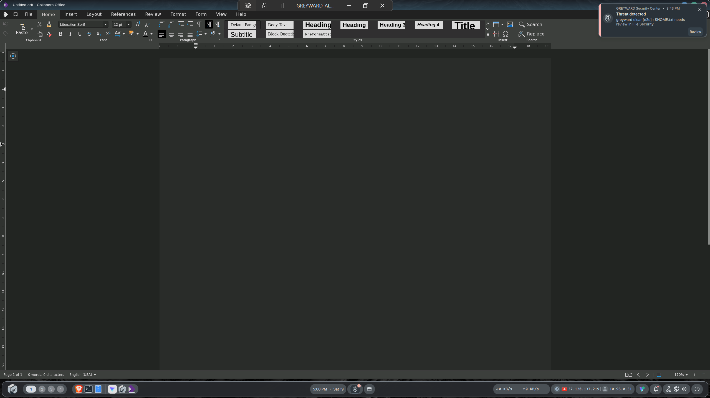
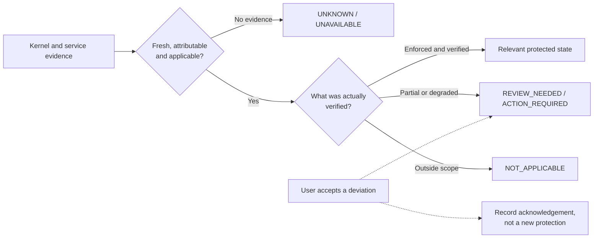
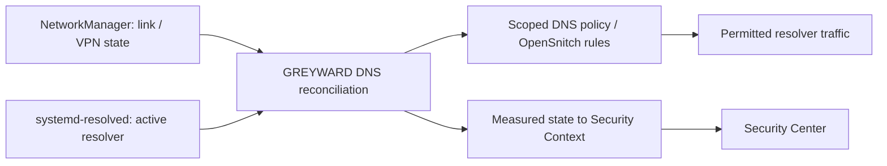
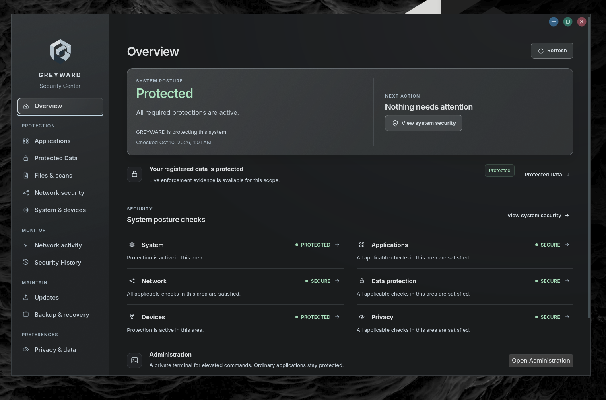
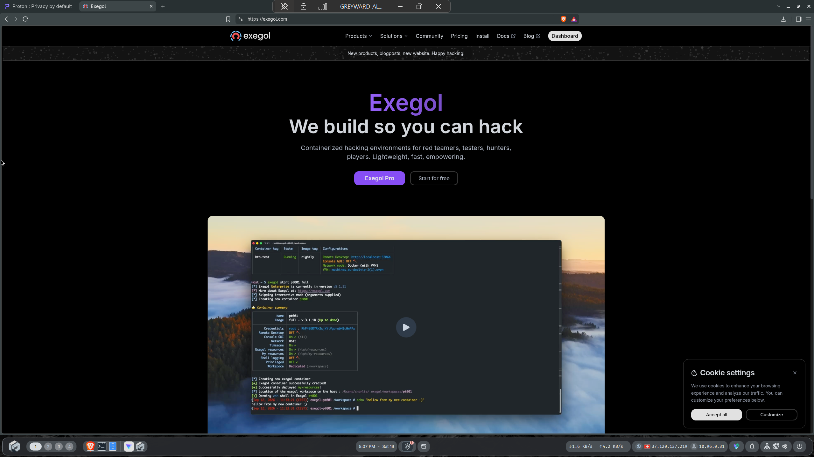

<p align="center">
  
</p>

<h1 align="center">GREYWARD</h1>

<p align="center">
  <strong>A security-focused Linux distribution trying to make stronger defaults livable.</strong>
</p>

<p align="center">
  
  
  
  
</p>

<p align="center">
  <sub>Fedora 44 · Labwc · DankMaterialShell · Tauri 2 · Rust · Python · SELinux</sub>
</p>

<p align="center">
  <a href="https://sourceforge.net/projects/greyward/files/v0.2.0/">
    
  </a>
</p>

<p align="center">
  <sub>Latest linked published image: 0.2.0 Nightfall. Features described below may reflect newer development builds and are not necessarily included in this ISO.</sub>
</p>

<p align="center">
  <a href="docs/architecture/ISO_CREATION.md">Install &amp; test</a>
  · <a href="HARDWARE_TESTING.md">Hardware testing</a>
  · <a href="ARCHITECTURE.md">Architecture</a>
  · <a href="CONTRIBUTING.md">Contribute</a>
</p>

<p align="center">
  <a href="#why-greyward">Why GREYWARD?</a>
  · <a href="#what-makes-it-different">Features</a>
  · <a href="#architecture-at-a-glance">Architecture</a>
  · <a href="#application-guard">Application Guard</a>
  · <a href="#protected-data">Protected Data</a>
  · <a href="#security-center">Security Center</a>
  · <a href="#a-desktop-of-its-own">Desktop</a>
  · <a href="#current-state-and-limitations">Status</a>
</p>

<p align="center">
  
</p>

---

GREYWARD is an experimental Linux distribution built around an uncomfortable compromise:

**Raise the default security posture of a general-purpose desktop without making it miserable to use.**

It combines a distinctive desktop, Fedora's security foundations, GREYWARD-specific policy and privileged services, and a Security Center that tries to explain what the system can *actually* enforce.

It is not a collection of security toggles. The interesting work happens where applications, identity, files, networking, the desktop session and administrative authority meet.

The goal is a machine you can eventually daily-drive without becoming its full-time security administrator.

**GREYWARD is not there yet.** It remains pre-release software. Some controls have been exercised on a development machine; others are partial, experimental or waiting for clean-install and hardware validation.

> [!WARNING]
> **Do not treat GREYWARD as a mature, independently audited hardened distribution.** The architecture has important trusted components and known gaps. Development-build behavior is not a security guarantee for a released ISO.

# Why GREYWARD?

Linux already has more distributions than any ecosystem has a reasonable excuse for. GREYWARD should have to justify becoming another one.

The thesis is that a general-purpose desktop can offer:

- **Stronger defaults:** real operating-system enforcement where it is useful, not just warnings.
- **Explicit boundaries:** ordinary applications should not automatically inherit access to selected sensitive resources.
- **Narrow exceptions:** legitimate access should not require disabling an entire protection.
- **Visible evidence:** security claims should depend on observable state, freshness and coverage.
- **Usable ownership:** the terminal, normal applications and administrative control remain available.
- **One coherent environment:** desktop UX, policy, services, recovery and image construction developed together.

The distribution model is a hypothesis, not a sacred architectural decision. Some components may ultimately be better upstream or as standalone projects. Open development is how that gets tested.

# What makes it different?

| Area | GREYWARD's current direction | Important qualification |
| --- | --- | --- |
| **Application Guard** | Identifies applications and provides supported managed execution and security workflows. | Not all native processes are individually sandboxed. |
| **Protected Data** | Registers selected sensitive resources for kernel-enforced SELinux access restrictions. | Protection applies to enrolled resources, not the entire home directory. |
| **Application Security broker** | Privileged, typed operations with process/identity checks and narrow reviewed access paths. | Existing grant support is limited; this is not a universal permission broker. |
| **Protected session boundaries** | Separate domains for sensitive authentication/display components and controlled Administration. | Trusted compositor, broker, kernel and providers remain important attack surfaces. |
| **Security Center** | Unified status, findings and workflows with evidence and uncertainty. | A displayed control is not proof that every associated threat is mitigated. |
| **Network & devices** | OpenSnitch, firewalld, managed DNS/VPN interactions and USBGuard integration. | Outbound network access is not default-deny; VPN leakage and physical USB cases need testing. |
| **Files, updates & recovery** | ClamAV, Safe Open, quarantine, update preparation, Btrfs and Restic workflows. | Scan coverage and full recovery/rollback validation are incomplete. |
| **GREYWARD desktop** | Labwc + a customized DankMaterialShell with a restrained graphite-and-silver identity. | Compatibility, screen sharing and hardware coverage remain active work. |

**Implementation status is intentionally more precise than a single “secure/not secure” label.** See [Current state and limitations](#current-state-and-limitations).

# Architecture at a glance

GREYWARD builds on Fedora rather than replacing the kernel's security model with a custom one. It separates **presentation**, **evidence**, **privileged decisions** and **kernel enforcement**.


```mermaid
flowchart TB
    subgraph UX["Desktop and user-facing surfaces"]
        DMS["Labwc + GREYWARD / DMS"]
        UI["Security Center · Tauri frontend"]
    end

    subgraph Observation["Evidence and coordination"]
        CTX["Security Context · typed D-Bus API"]
        COL["System collectors and existing providers"]
        EVT["Findings · history · notifications"]
    end

    subgraph Authority["Privileged security boundary"]
        BR["Application Security broker"]
        ADM["Protected Administration / authentication"]
        POL["Root-owned policy · resource identity · reviewed grants"]
    end

    subgraph Kernel["Operating-system enforcement"]
        SE["SELinux domains and resource labels"]
        ISO["Namespaces · Landlock · seccomp\nfor supported managed workloads"]
        OS["Fedora / kernel / LUKS / firewall"]
    end

    UI -->|"read evidence / request typed operations"| CTX
    COL --> CTX
    CTX --> EVT
    EVT --> DMS
    CTX -->|"supported security requests"| BR
    BR --> POL
    ADM -->|"protected authorization"| BR
    POL --> SE
    BR --> ISO
    SE --> OS
    ISO --> OS
```

*Conceptual diagram, not a claim that every feature is active or that every D-Bus operation takes exactly this route. In particular, Security Center is a user interface; SELinux enforces protected-file access in the kernel, not in the window displaying the decision.*

### Trust boundaries matter

An ordinary app is not trusted simply because it belongs to the logged-in user. At the same time, GREYWARD does not attempt to turn every desktop process into a fully isolated container.

The trusted computing base still includes the kernel, loaded policy, privileged services, authentication and display components, and build/package inputs. Compromise of one of those components may defeat the protections it owns.

The distinction between an **observed state**, an **enforced boundary** and a **tested end-to-end workflow** matters throughout the project.

# Application Guard

Application Guard is the application-facing part of GREYWARD's new security architecture.

The design connects application identity, effective permissions, controlled execution, protected resources and activity into a single model:

**Application → Protection → Permissions → Protected Data → Activity**

It is intended to answer practical questions: *What is this program? What can it reach? Which restrictions are active? What happens if it needs a protected resource? What evidence supports those answers?*

### What exists in development

- A privileged Application Security service and typed interfaces for supported operations.
- Checks involving requester identity and process/security context, with root-controlled policy state.
- SELinux-backed protections that ordinary workloads cannot simply override through the UI.
- A **managed native execution path** using Linux mechanisms such as namespaces, Landlock and seccomp.
- Bounded handling for supported scripts, AppImages and selected-file launch workflows.
- Application-related status and activity integrated into the broader Security Center model.

These mechanisms have different scopes. **Managed confinement is not automatically applied to every native program launched normally.** Upstream Flatpak sandboxes remain an independent layer whose permissions depend on the application's manifest and overrides.

### What Application Guard is not

It is **not** a complete Android-style permission system for Linux applications. A general “Allow once / Allow always / Deny” dialog that reliably authorizes arbitrary native applications, scripts and Flatpaks to read and edit protected resources has **not** been delivered.

Nor does a successful launch prove a complex application's secondary workflows, such as document saving, printing, IDE helpers or screen sharing, are compatible.

# Protected Data

Protected Data adds explicit operating-system protection to **registered sensitive resources**.

Ordinary Unix ownership and permissions are often too coarse for this problem: multiple applications running as the same user can normally reach the same home-directory files. GREYWARD adds a separate mandatory boundary for selected resources through SELinux labels and confined domains.

This is **access control**, not encryption at rest, a hidden folder, a universal vault or data-loss prevention.

### How the boundary works


```mermaid
flowchart TD
    A["Application or script"] --> Q{"Which resource and\nexecution context?"}
    Q -->|"Ordinary file"| N["Normal filesystem permissions apply"]
    Q -->|"Registered Protected Data"| K{"SELinux access check"}
    K -->|"Ordinary, unauthorized domain"| X["Access denied"]
    K -->|"Specifically prepared and\nauthorized supported workflow"| Y["Only its permitted operation"]

    R["Protected review + trusted broker"] -->|"Establish supported grant / workload"| Y
    P["Root policy + resource labels"] -.-> K

    classDef deny fill:#49272d,stroke:#9a5b65,color:#fff
    class X deny
```

The critical distinction: **the kernel denies unauthorized access even when an application never opens Security Center**. Policy review is relevant when a supported access workflow exists; it is not a generic interception prompt for every failed file open.

### Current access model

| Situation | Current behavior or limitation |
| --- | --- |
| Ordinary file outside Protected Data | Normal Linux/Flatpak permission behavior. |
| Ordinary application reads registered protected material | Denied under the enforced policy for the enrolled context. |
| Supported fixed-purpose credential inspection | A narrow, tested read-only, non-exporting inspection workflow exists. |
| General SSH authentication, GPG signing or IDE key use | Not covered by that inspection grant. |
| Generic editing and saving of a protected document | Not delivered as a general workflow. |
| Flatpak opens protected material through its normal file chooser | No verified general-purpose original-file authorization/edit/save path. |
| Application makes a copy after legitimate read access | Not prevented by resource-label continuity; this is not anti-exfiltration. |

**Registration is explicit.** Protecting one sensitive directory does not magically protect every browser token, SSH key, cloud credential or document on the machine. The catalogue must be verified and expanded deliberately.

### Why not just give the app an exception?

Because a useful exception must be tied to the correct executable, resource, operation and active workload. A file chooser or portal forwarding a request does not, by itself, prove which application originally requested it.

GREYWARD therefore prefers an honest **unsupported** result over an attractive permission dialog whose authority cannot be verified.

# A protected session, not a locked-down toy

Application security is only part of the design. Development builds also include separate protection work around the desktop session, authentication and administrative operations.

- SELinux Enforcing supplies the mandatory foundation for enrolled accounts and registered resources.
- Sensitive desktop authentication/display components use dedicated policy boundaries.
- Administration is a deliberate privileged workflow, not an invisible privilege increase available to arbitrary desktop code.
- Selected D-Bus inspection/ptrace restrictions have been tested in development; their release packaging must be verified separately.

These are meaningful additions, but the limits matter:

- Ordinary native programs can still access much ordinary user data and, in many cases, interact with other ordinary processes.
- A privileged administrator can change system policy; GREYWARD is not meant to take ownership away from the machine's owner.
- The privileged broker and trusted services themselves require continued audit and hardening.
- Some older privileged network-control interfaces have had weaker authorization boundaries than the newer protected workflow. Their closure must be verified, not assumed.

# Security Center

Security Center is the interface through which GREYWARD makes security posture, supported controls and failures understandable.

| Network Activity | Unified Updates |
| :---: | :---: |
|  |  |

| Area | Integration and scope |
| --- | --- |
| **System** | SELinux, Secure Boot, LUKS, TPM, firmware, administrative and recovery state. |
| **Applications** | Application identity, supported Application Guard workflows, Flatpak permissions and effective access evidence. |
| **Protected Data** | Registered-resource state and the supported reviewed access paths. |
| **Network** | OpenSnitch, firewalld, NetworkManager, managed DNS and VPN-aware policy reconciliation. |
| **Files** | ClamAV, selected-file scanning, provenance, quarantine/restore and Safe Open. |
| **Updates** | DNF5, Flatpak, fwupd and ClamAV database update paths. |
| **Devices** | USBGuard policy, device history and selected camera/microphone observations. |
| **Recovery** | Btrfs recovery points and Restic-backed personal backup workflows. |

<p align="center">
  
</p>

<p align="center"><sub>Security information should stay visible without taking over the desktop.</sub></p>

### Evidence before reassurance

Security Center uses a posture vocabulary that keeps uncertainty visible:

```text
SECURE · PROTECTED · REVIEW_NEEDED · ACTION_REQUIRED
UNKNOWN · UNAVAILABLE · NOT_APPLICABLE
```

The visual status must reflect the **scope of the measurement**. A running VPN interface does not prove a kill switch or absence of DNS leaks. Available ClamAV definitions do not prove real-time scanning. A user-accepted missing control does not mean that the control has become active.


```mermaid
flowchart LR
    SRC["Kernel and service evidence"] --> VAL{"Fresh, attributable\nand applicable?"}
    VAL -->|"No evidence"| UNK["UNKNOWN / UNAVAILABLE"]
    VAL -->|"Yes"| COV{"What was actually\nverified?"}
    COV -->|"Enforced and verified"| GOOD["Relevant protected state"]
    COV -->|"Partial or degraded"| WARN["REVIEW_NEEDED / ACTION_REQUIRED"]
    COV -->|"Outside scope"| NA["NOT_APPLICABLE"]
    ACC["User accepts a deviation"] -.-> WARN
    ACC -.-> NOTE["Record acknowledgement,\nnot a new protection"]
```

These are conceptual state transitions. Individual collectors use their own evidence and evaluation rules; the diagram does not assign a universal status to every feature.

> [!NOTE]
> **Security Center describes evidence; it does not create the underlying guarantee.** Collectors, privileged providers and UI wording can be wrong. Validation includes testing the actual restriction, not merely checking for a green label.

# Security gets interesting when systems interact

Individual controls are often straightforward. Their interactions are not.

Consider DNS protection during a VPN connection:


```mermaid
flowchart LR
    NM["NetworkManager: link / VPN state"] --> REC["GREYWARD DNS reconciliation"]
    RES["systemd-resolved: active resolver"] --> REC
    REC --> FW["Scoped DNS policy / OpenSnitch rules"]
    FW --> OUT["Permitted resolver traffic"]
    REC --> EVID["Measured state to Security Context"]
    EVID --> UI["Security Center"]
```

Blocking all unexpected DNS traffic can break legitimate VPN operation. Allowing DNS globally makes a bypass restriction ineffective. GREYWARD attempts to reconcile policy with observed network state and use narrow allowances where possible.

But **VPN detected** does not mean **encryption independently verified**, **leak-proof** or **kill switch tested**. Those require separate evidence and real failure testing.

The same principle applies to application permissions, USB admission, malware response, updates and recovery. The important question is not just *“Is the switch on?”* but *“What does this protection still guarantee when the rest of the system changes?”*

# A desktop of its own

GREYWARD is meant to feel like GREYWARD.

Its shell, settings, Security Center, notifications and interaction patterns share a deliberate visual direction. The current language is dark and restrained: graphite, silver accents, controlled transparency and relatively low visual noise.

| Desktop overview | Everyday application use |
| :---: | :---: |
|  |  |

| Layer | Current implementation |
| --- | --- |
| **Foundation** | Fedora 44 |
| **Compositor** | Labwc |
| **Session** | UWSM-managed Wayland |
| **Shell** | DankMaterialShell adapted for GREYWARD |
| **Security UI** | GREYWARD Security Center and integrated notifications |
| **Visual system** | GREYWARD branding, assets and interaction direction |

The terminal remains available. Users are not locked out of the underlying operating system, and advanced users can inspect or change policy.

Accessibility, multi-display behavior, suspend/resume, application compatibility and consistent session behavior still need work. The project values a visually coherent system, but aesthetics are not a substitute for reliability or enforcement.

# Security and usability are a trade-off

Some stronger defaults will break things. That is not automatically a reason to remove them.

The challenge is whether a restriction has a meaningful benefit and a workable legitimate path. A protection that cannot be explained, tested, recovered from or used with ordinary software is not automatically a good product decision.

GREYWARD aims for a practical balance:

1. Ordinary files and applications should remain ordinary wherever stronger treatment is unnecessary.
2. Sensitive registered resources should have a meaningful mandatory boundary.
3. Supported exceptions should be narrow, attributable and reviewable.
4. An unsupported workflow should fail honestly rather than silently fall back to unrestricted access.
5. Recovery must be tested as carefully as enforcement.

This is why Application Guard and Protected Data are being developed alongside the normal desktop, rather than pretending one generic sandbox can safely cover every workload.

# Current state and limitations

GREYWARD is in **pre-release alpha/beta development**. The table below describes the reported development-system posture, **not a certification or validation of the linked downloadable ISO**.

| Capability | Development status | What remains |
| --- | --- | --- |
| Fedora base and GREYWARD desktop | Implemented | Wider bare-metal and multi-display acceptance. |
| SELinux Enforcing and selected custom domains | Verified on the development environment | Clean-install policy/enrollment verification and broader user coverage. |
| Protected Data registration and mandatory denials | Partially verified | Broader resource catalogue, lifecycle and legitimate-workflow coverage. |
| Application Security broker and supported managed launches | Implemented with bounded tests | Broader native/Flatpak compatibility and independent security review. |
| Fixed-purpose reviewed key-inspection grant | Narrow workflow tested | Not equivalent to general SSH/GPG/IDE access. |
| Generic protected-file authorization and Flatpak editing | **Not delivered** | Verified original-file chooser, authorization, edit/save/reopen and attribution. |
| Separate sensitive authentication/display boundaries | Tested in development | Release packaging, upgrade and recovery verification. |
| Additional D-Bus inspection isolation | Tested development overlay | Packaging and clean-install acceptance. |
| OpenSnitch, firewalld and managed DNS | Active integrations | Authorization hardening, VPN leak/failover tests, policy assurance. |
| USBGuard | Configured | Physical USB-device admission and recovery tests. |
| ClamAV and quarantine | Engine/workflows exercised | Correct ordinary-session status projection and full live acceptance. |
| Updates, Btrfs snapshots and Restic | Partial workflows | End-to-end rollback, backup restore and offline-repair acceptance. |
| Screen sharing | **Known broken/unavailable in audited environment** | Portal/compositor compatibility repair. |
| Secure Boot and TPM | Not established in the audited VM | Hardware-specific verification, without assuming protection. |
| ISO installation and first boot | Release pipeline exists | Fresh ISO build, clean VM install, first-boot and hardware validation. |

**Specific caveats:** ordinary same-user processes are not universally separated; registered-resource coverage is not comprehensive; default outbound network policy is not a general anti-exfiltration boundary; scanner signatures do not guarantee malware detection; snapshots are not proven backups; successful tests on a development machine do not prove an ISO installs with the same guarantees.

### Current priorities

- Reproducible image construction and clean-install validation.
- Release packaging of the intended SELinux policy and session enrollment.
- Correct security-status wording and authoritative evidence collection.
- Legitimate access to protected material without bypasses or unusable applications.
- Privileged service authorization and trusted-component hardening.
- Screen sharing, VPN edge cases and routine desktop compatibility.
- Update recovery, Restic restore and offline repair.
- Bare-metal testing, hardware coverage, suspend/resume, accessibility and multi-display behavior.
- External threat modeling, code review and security testing.

> [!NOTE]
> Screenshots show real GREYWARD development builds. Visual completeness, a passing unit-test suite and a successful ISO build are **not** equivalent to a security-reviewed release.

# Open development

GREYWARD is free and open source partly because its assumptions should be exposed to scrutiny.

If the architecture is wrong, challenge it. If an upstream mechanism already solves the problem better, use it. If a custom service creates more risk than value, simplify it. A contributor removing unnecessary code can do more for security than one adding another dashboard.

The source being public is not evidence that it is good. It is an opportunity to make that question answerable.

# Contribute

GREYWARD is currently a one-person project.

I am **not a professional software developer or security researcher**. There will be Linux mechanisms I missed, assumptions that fail on real hardware and architectural decisions that deserve to be reconsidered.

Useful contributions can begin with:

> This security assumption is wrong.
>
> This can be done much more cleanly.
>
> Linux already solves this.
>
> This breaks on my hardware.
>
> This restriction costs too much usability for what it provides.

Particularly useful expertise includes Linux/Fedora internals, SELinux, Polkit, NetworkManager, firewalld/nftables, Rust, Tauri, Wayland, packaging, image construction, threat modeling, testing and UX/accessibility.

**Try it. Break it. Question it. Improve it.**

See [`CONTRIBUTING.md`](CONTRIBUTING.md). Security reports should follow [`SECURITY.md`](SECURITY.md).

# AI disclosure

Most of GREYWARD's code has been written with **AI coding agents**.

I am not a coder, and I do not want the repository to imply otherwise.

AI is used to turn system behavior, product ideas, debugging results and implementation goals into working code. Changes are tested and iterated against the real system, but that is not equivalent to experienced human engineering or independent security review.

There will almost certainly be places where an experienced developer sees a cleaner or safer implementation.

**AI helps build GREYWARD. Open review is how it can become more robust.**

# Repository and technical references

```text
GREYWARD/
├── environment/        # production system, image and session
├── security-center/    # application, backend, services and tests
├── packaging/          # RPM definitions
├── branding/           # identity and system assets
├── tests/              # validation
└── tools/              # development tooling
```

Repository validation:

```powershell
pwsh -NoProfile -File .\tests\static.ps1
pwsh -NoProfile -File .\tools\validate-repository.ps1
```

Security Center validation:

```bash
cd security-center
cargo fmt --all -- --check
cargo test --workspace --locked
cargo clippy --workspace --all-targets --locked -- -D warnings
node --test tauri/frontend/ux-contract.test.mjs
```

Technical references: [installation](docs/architecture/ISO_CREATION.md) · [architecture](ARCHITECTURE.md) · [threat model](THREAT_MODEL.md) · [testing](TESTING.md) · [hardware testing](HARDWARE_TESTING.md) · [privilege model](docs/security/privilege-model.md).

# Licensing

GREYWARD-authored **source code and documentation** are licensed under [`GPL-3.0-only`](LICENSE), except where explicitly stated otherwise.

Third-party software and assets retain their respective licenses. See [`THIRD_PARTY_NOTICES.md`](THIRD_PARTY_NOTICES.md).

The **GREYWARD and MANTIS SYSTEMS names, logos, visual identity and designated branding assets are not licensed for general reuse under GPL solely because they are stored in this repository**.

See [`LICENSING.md`](LICENSING.md) for branding and naming terms.

---

<p align="center">
  <sub>Stronger defaults · Enforceable boundaries · Visible evidence · Distinct desktop · Open to challenge</sub>
</p>
