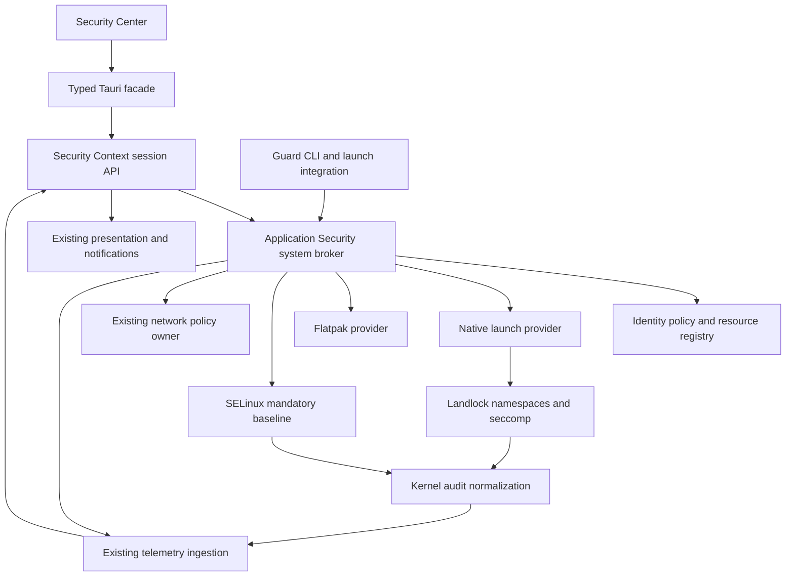

# GREYWARD Application Security Platform

## Targeted truthfulness correction — source only, 9 October

The verified session baseline covers enrolled execution routes and registered
resource labels. `deputies_and_portals=false` means **not independently verified**;
it is no longer derived from seat/labels or required to display that narrower
baseline. It does not authorize generic portal/Flatpak grants. Portal attribution
and complete deputy isolation remain UNKNOWN and are explicitly disclosed.
Accepted deviations retain their measured check state and visible limitation;
only recommendation aggregation suppresses repeated attention. Acceptance never
activates Secure Boot, a TPM, recovery or another missing safeguard. Overview's
PROTECTED label refers to verified protections with accepted limitations, not
“All required protections are active.” Reviewed access is labelled SSH key
inspection; generic native/Flatpak/script/IDE access remains unavailable.

These are source changes with local regression evidence, not a new `.149`
installed tuple. See the [scoped receipt](../history/security-center/2026-10-09-security-truthfulness.md)
for validation limits and matched deployment/rollback requirements.

Status: APPROVED; implementation in progress. This is the application-security
delivery authority, not evidence that whole-session protection is available.
Approved on 6 October 2026. Existing product authorities remain current until
their corresponding implementation passes acceptance.

## Bounded hybrid Flatpak proof — BLOCKED, 9 October 2026

**Latest prerequisite:** the [D-Bus boundary proof](../history/security-center/2026-10-09-dbus-boundary-proof.md)
validates a small explicit development CIL overlay that denies ordinary process
inspection of the existing user/a11y buses, preserving messaging/FD masks and
stock chooser/Context/Administration readbacks. All 62 ordinary domains deny
ptrace; actual memory-open and invalid-FD probes deny; rollback/reapply succeeds
without restarting the bus or session. Existing native root reviews reject
foreign/exited actors, stale revisions and changed selections without grants.
This resolves the observed inspection gap only. Root-verified Flatpak portal
request-to-recipient binding and protected approval remain NOT IMPLEMENTED;
both product gates remain unpassed. The active module is unpackaged development
policy, not production enrollment. Work stops before expanding the bridge.

The approved experiment combines a generic broker-prepared Flatpak subject with
a small FileChooser review bridge and one pinned frontend hook before original
file opening/export. Registered originals must remain on their filesystem;
shared portals receive no protected-content permission. Ordinary selections
retain GTK/upstream behavior. Root must bind the live proxy/workload, deployment,
runtime, registered folder and policy revision; app IDs and historical AVCs are
not authority. Once means workload lifetime; always is generation/scope/revision
bound; revocation withdraws future access without recalling existing handles/data.

**Earlier execution result:** the development-only launch bootstrap and a read-only
shared-bus check are implemented. Both product gates remain **NOT DEMONSTRATED**.
The actual same-UID session bus is inspectable by an ordinary enrolled process:
memory read descriptor open succeeds, and an invalid `pidfd_getfd` probe passes
the attach-mode check. No memory was read/written or valid FD copied. Consequently
the current bus/frontend/proxy closure cannot yet supply the required protected
identity-forwarding boundary. A frontend-only patch is insufficient. See the
[bounded execution receipt](../history/security-center/2026-10-09-hybrid-flatpak-bootstrap.md).

Work stopped before grant or UI integration to reassess that prerequisite.
Protecting and freshly activating the shared IPC closure would widen this proof
and can disrupt the active desktop; no such change was made under the no-session-
restart constraint. This is a NO-GO for proceeding against the current closure,
not proof that every hybrid solution is impossible. No private portal, custom
filesystem, second daemon, broad allow or app-specific exception was introduced.

The remaining approved gate requires Collabora **and GNOME Text Editor**, using
the same mechanism, to reach review from normal Open, open/edit/save/reopen the
original, reuse persistent permission and lose future access after revocation.
Other same-UID Flatpaks, native workloads and unregistered scripts must stay
denied. User decisions (Deny/once/always/revoke) remain reserved for the user;
Codex performs technical setup and checks without preauthorization. No graphical
authorization entry point is ready. Scripts, broader UI and general Sensitive
files provisioning remain gated. Investigation budget: five working days;
substantial portal/filesystem infrastructure, recurring extra upstream patches,
app exceptions or frequent relaunches require stopping and reassessment.

## Previous first-use Flatpak prerequisite — historical blocked result

The approved minimal continuation requires workload-specific folder access and
automatic denial → notification → verified Review → user decision → retry
before full UI, script grants or general Sensitive files provisioning. Folder
scope is explicit; Collabora is a representative installation, not a policy.

The [installed prerequisite experiment](../history/security-center/2026-10-09-first-use-permission-proof.md)
found sandbox-hidden paths produce no resource AVC, while the stock FileChooser
denial belongs to the shared GTK portal, not the requesting Flatpak. App-only
permission leaves that chooser denied; shared-portal access cannot be added
without resolving its deputy and host FUSE alias boundary. Gate A remains
NOT DEMONSTRATED; Gate B is BLOCKED for the standard portal path. Negative
controls pass, not the feature gates.

The generic development probe makes no policy/grant/override changes or secret
content reads. Work stopped at the required architecture boundary: no portal
fork/private portal, application-specific workaround, broad allow, new daemon,
full UI or script provider was added. The user alone performs actual Allow
once/always, Deny and Revoke once a safe test is ready; there is no end-to-end
authorization test entry point yet. Protection and Administration are unchanged.

## Current normal-session implementation — 8 October 2026

9 October normal-seat follow-up: installed Center 89 / Context 81 / runtime 32
and session package 8 activate the approved Administration boundary through
normal greetd/PAM. Actual sudo handoff, confined root, native lock, generic
Flatpak launch preparation, ordinary GTK selection and reviewed grant reuse/
revocation pass. The [compatibility receipt](../history/security-center/2026-10-09-desktop-compatibility.md)
records the precise tests, development overlays and remaining functional gates.
Screen sharing is unavailable under protected compositor capture restrictions;
full desktop rollback, VPN connection and production rescue remain unpassed.
These results do not implement the unsupported script/IDE grants described below.

9 October access-review correction (deployed Center 87 / Context 80 / runtime 28): sensitive-denial notifications previously
opened Network Activity. Review now targets Protected Data with the validated
registered-resource reference; the Center opens that resource and its related
denial history. The plugin's formerly unhandled `open` action is implemented
and its root-owned development widget overlay was reloaded in place. Actual
plugin Review navigates from Overview to that resource; native wake-up also
restores a minimized Center. Review and system-notification Dismiss never
authorize access. The widget does not offer an unsupported Dismiss action. The access view
discloses the current supported tool profile (restricted SSH-key inspection)
and reports unsupported script/IDE grant preparation without claiming success.
Arbitrary script and VS Code raw-key grants, their tested launch profiles and
restrictive temporary fallback remain **undelivered functional work**, not
DEFERRED HARDENING. A generic interpreter grant is not a substitute. The user's
legitimate-versus-threat scripts remain the acceptance case for that work.

Post-reboot repair now uses runtime 28 with stable filesystem identity for
registered-directory reopening and tested descendant namespace permissions for
Brave's real portal/Zypak launch. That repair was validated with Center 85 /
Context 76; subsequent scoped package changes are recorded in STATUS.
The actual Applications view, browser HTTPS and public-IP widget were checked;
mandatory native/Flatpak resource denials remain intact. See the
[repair receipt](../history/security-center/2026-10-08-session-resource-flatpak-recovery.md)
for causes, the explicit legacy receipt migration and deferred lifecycle gates.

The normal `.149` development account is deliberately enrolled. Actual greetd
PAM, its ordinary user manager and SSH shell use the confined role. A root-owned
matched Labwc seat and separate DMS native authentication are active; Fedora
PAM/authselect remain unchanged. Fresh root coverage reports PROTECTED /
AVAILABLE for this enrolled scope. Resource labels are reopened and checked
against actual objects and kernel policy; stored metadata alone is insufficient.

Real descriptor registration and freshly authenticated reviewed key-inspection
grant creation pass on the normal account. Ordinary/direct execution is denied;
two unchanged managed launches succeed without another prompt. Existing Flatpak
permissions are preserved; the real Brave sandbox reads ordinary data and
cannot read the registered key. Only nonexporting `openssh-key-inspection/v1`
is profiled. Unknown tools, IDE/raw signing, WRITE and temporary raw grants
remain UNAVAILABLE. Inventory remains UNKNOWN independently of session coverage.

The installed Center now displays actual protected resources and reviewed
access. Its adapter accepts fresh authoritative coverage while refusing stale
leases, wrong owners and revisions. Native authentication focus and background
read contention are corrected in installed Center 66 / Context 68 / runtime 25.
Actual GUI revocation publishes verified completion and denies subsequent
launch; registered data stays protected across broker restart. See the
[normal-session receipt](../history/security-center/2026-10-08-application-security-normal-session.md)
for live evidence, exact package scope and recovery.

The subsequent [workspace delivery](../history/security-center/2026-10-08-security-center-workspace.md)
installs Center 68 / Context 69 with runtime 25 unchanged. It restores dedicated
Network Activity and separates Security History/recovery, preserving the real
normal-session protection and typed workflows. [UX_SPEC.md](UX_SPEC.md) owns
the current navigation/component contract; the original destination outline
below is superseded where it combines these monitoring surfaces. Fresh final
coverage, direct denial, normal Flatpak behavior and all installed routes pass.

The [refresh/theme repair](../history/security-center/2026-10-08-protection-refresh-theme.md)
installs Center 70 / Context 69 / runtime 26. Visible renewal accounts for
read latency before the five-second evidence lease, and unchanged projections
keep their DOM/focus. True expiry still withdraws positive protection. The
protected Labwc closure now contains canonical root-owned theme/button assets;
the normal admitted seat reloads them without a session restart. These changes
do not widen the authentication or resource/grant boundaries.

The subsequent [visual polish delivery](../history/security-center/2026-10-08-security-center-visual-polish.md)
installs Center 72 with Context 69 / runtime 26 unchanged. Canonical material
tokens, semantic states, responsive Network Activity and native EN/FR startup
are validated in the actual desktop. Registration/grant authority is unchanged;
live expiry, ordinary/direct/revoked denial and Flatpak compatibility pass.
Inventory uncertainty and unsupported grant profiles remain explicit.
The subsequent [focused quality pass](../history/security-center/2026-10-08-security-center-quality-regressions.md)
installs Center 73, with Context 69/runtime 26 unchanged. Actual native screen
and reversible-interaction review covers graphite materials, icon corrections
and density. It does not alter or broaden resource/grant authority.

The [Security Activity context delivery](../history/security-center/2026-10-08-security-activity-context.md)
installs Center 75 / Context 71 / runtime 27. Correlated enforcing audit denials
retain bounded historical process metadata and kernel occurrence time without
inventing application identity. Security History and resource/application
activity share contextual rows and disclosures. Real normal-account denials,
connected protection and installed UI/package readback pass. No grant or
session-enrollment authority is expanded; older attribution stays UNKNOWN.

This is deliberate development enrollment, not automatic installer/domain/
service account enrollment or release acceptance. No ISO, installer, reboot
or LUKS change occurred. Production activation/upgrade/rescue lifecycle remains
unvalidated. Exhaustive matrices, performance, multi-user, physical/suspend and
clean-image acceptance are DEFERRED HARDENING for the current scoped objective.

## Historical implementation audit — 7 October 2026

The following audit records the superseded unenrolled state. Its negative
coverage, package tuple and activation blockers are historical; the current
section and normal-session receipt above take precedence.

This section records source truth as of 7 October. Sections 2–4 retain the explicitly dated
planning baseline; subsequent design sections describe the approved target,
not a claim that every provider is implemented. Chronological experimental
receipts have moved to [historical evidence](../history/security-center/2026-10-07-application-security-evidence.md).
The [production enrollment design](APPLICATION_SECURITY_ENROLLMENT.md) now
records accepted recovery/account/admin decisions and initial implementation.
Source includes the transactional journal, local-account/per-owner bindings and
an inert LUKS-authenticated maintenance console. Separate authentication source
now passes scoped same-UID denials, native DMS PAM and fresh protected GUI Polkit
checks. Reviewed persistent launches require tested profiles with exact
generation/revision/argument constraints; legacy generic launches refuse.
Only nonexporting pinned SSH-key inspection is currently profiled. Unsupported
temporary grants remain UNAVAILABLE. Activation is **BLOCKED** by production
seat/input integration, account admission, durable labels and lifecycle/recovery.
See the [scoped authentication evidence](../history/security-center/2026-10-07-application-security-authentication.md). The
installed public workflow broker is now explicitly active on `.149`, alongside
Center 64 / Context 67 / runtime 20. Normal local accounts can use restrictive managed
isolation; resource/grant changes still require confined enrollment and protected
authentication. Fresh negative enrollment evidence reports UNAVAILABLE on the
unenrolled normal account; no effective PROTECTED profile is advertised. No account mapping,
installer or image activation occurred. See the
[live development receipt](../history/security-center/2026-10-07-application-security-live-development.md).
The [live integration receipt](../history/security-center/2026-10-07-application-security-live-integration.md)
records the actual normal-desktop fix: serialized fresh reads preserve live
inventory/actions, broker loss expires them, and automatic recovery restores
them. Overview and its Applications summary cannot claim protection from legacy
checks alone. Protected Data explains the actual missing enrollment capability.

### Security Center product integration

`application-view.js` owns shared presentation using the existing typed
`application-security.js` controller. Applications has one coverage summary,
searchable inventory, private-isolation entry and contextual details. Protected
Data groups actual registered resources by category; folder selection is a
progressive review workflow. Access records are labelled as stored policy, not
active enforcement. Details connect permissions, reviewed access and filtered
local activity; technical evidence is disclosed separately. Flatpak permissions
retain their actual provider state in the same Applications destination without
merging installations by display name or duplicating an edit workflow.

Grant previews carry the root-selected tested profile through domain, Context,
Tauri and GUI validation. Missing/unknown profiles refuse review. The dialog
shows application, data scope, effect, tested restrictions and fresh authorization
before apply. The initial profile explicitly says key inspection, not general
SSH/IDE access. Existing operation readback, cancellation, freshness and route
ownership remain authoritative. EN/FR, native dialog focus/cancel, searchable
lists and scaled graphite/silver components use the existing visual system.

These components are installed and connected to the live broker on `.149`; this is not production enrollment. Missing
backend data remains unavailable; no preview data or bridge replacement is
shipped. See the scoped authentication receipt for runtime evidence and limits.
The earlier private native-window check passes for real unavailable responses
on both redesigned routes, shared history and CSP. Focused final checks pass:
145 runtime/domain Rust tests, 8 Context workflow tests and 99 frontend tests;
21 explicit Rust integration tests remain ignored. This does not validate a
production session or a GUI grant authorization/commit transaction.

### Architecture and implemented boundaries

| Area | Source present now | Effective scope / outstanding work |
|---|---|---|
| Broker / policy | Shared identity, schema-four root-owned registry/intention/label/enrollment journal, bounded reads, revisions, kernel-bound caller and operation ownership. | Default service exposes five reads. Explicit installed workflow service is active on `.149` using the same public bus/store; no preset or image inclusion. Public coverage uses fresh negative prerequisites: the unenrolled normal account is UNAVAILABLE; positive coverage is not implemented. |
| Development workflows | Separate `ApplicationSecurityDevelopment1` bus, descriptor registration, fresh authorized review/apply/cancel/readback, grant revocation and prepared launch. | Provider, paths, labels and policy modules are fixed to isolated UID 1002. Not a selectable production provider. |
| Protected Data | O_PATH directory selection retained through root preparation; bounded label application, original-object journal and live kernel policy/object readback. | Four synthetic objects tested; limit 1,024 objects/depth 16. Unsupported symlinks, special files/mounts and unsafe replacement refused. Production persistent label/reconciliation coverage is open. |
| Grants / Guard | Immutable executable/installation generation; profiled persistent READ grants, root-prepared entry, disjoint subjects and reference-based revoke. | Only pinned nonexporting `openssh-key-inspection/v1` can currently create/reuse a grant. Legacy generic records are withdrawable, never launchable. WRITE/temporary raw grants, SSH login/signing and IDE profiles unavailable. Package membership is not approved signer/source provenance. |
| Native isolation | Held ELF and fixed Python/sh/bash script/interpreter generations; Type-2 x86_64 AppImage ELF/SquashFS validation and confined extraction. | No execution of downloaded AppImage runtime/FUSE, no unrestricted fallback. Unsupported formats unavailable. |
| Graphical ISOLATED | Broker-created security-context connection and private nested Labwc/clipboard/Xwayland; verified worker namespaces, privileges, SELinux, Landlock ABI 9 and seccomp. | Private home and network off; no host compositor/X11/session bus exposure. Display helper now binds the actual validated workload UID instead of UID 1002. No whole-host clipboard isolation claim. |
| Safe Open | Descriptor survives classification/handler selection into `PrepareSelectedDocumentLaunch`; ordinary selected documents/code share the same managed runner and lifetime. | Standalone sandbox/fallback removed; protected-label content is refused. Configured Flatpak selected-document handlers explicitly UNAVAILABLE, with no handler substitution. |
| Flatpak | Exact-installation effective-context collector, raw override observations and revision-checked identity intake; existing sandbox/overrides retained. | Minimum ordinary access/protected denial tested. Automatic unified population, provider mutations and protected portal/export production coverage remain open. |
| Center / Context | Typed Tauri commands and owner-pinned Context workflows; category picker, native READ grant review/apply/cancel/revoke, isolated picker, related grants and Activity filtering in EN/FR. | Center 64 / Context 67 / runtime 20 use the installed live broker. Normal-desktop native reads, route refresh, broker loss/recovery and accurate Overview/Applications negative coverage pass. Actual normal-account graphical preparation/start and selected-document isolation pass. Full GUI protected grant authorization/commit remains unvalidated. Flatpak permissions retain separate provider semantics; full controller decomposition is deferred. |
| Activity / notifications | Bounded root AVC + failed SYSCALL evidence enters existing telemetry, aggregation and Review/Dismiss publisher; no second Activity database or immediate Allow. | Attribution UNKNOWN; observed denial is not a malware diagnosis or coverage proof. Buffer/rotation gaps flagged; full audit completeness and raw-byte backlog reporting not established. |
| Session enrollment | Private PAM/user-manager enrollment and direct/interpreter/service routes proven on separate synthetic account. | Production greetd authentication/session, automatic enrollment, multi-user policy and public live coverage are NOT IMPLEMENTED. |

The webview and user history remain presentation, never authorization. Context
pins the root broker owner and enforces freshness. Fresh Polkit owner review is
bound to the actual peer, operation, generation and revision; administrator
review owns system-policy changes. Authorization success, journal storage or
process existence does not prove enforcement. The baseline compiler currently
denies the development ordinary subject, not every possible production domain.
Do not ship the prototype's synthetic owner-role/test allowances.

Reviewed raw READ access is shared by code/extensions inside that tool. Revoking
access cannot recall already-read data. A worker deadline is not proof of timed
raw-grant support. Directory labels protect registered supported objects, not
arbitrary secret copies or every secret in a home. Root/kernel/policy-broker
compromise remains outside this isolation boundary.

### Validation evidence and its limits

VALIDATED means only the named scoped check actually ran. Latest historical
`.149` source receipt: `application-security-registration-guard.sh --workflow`,
authentication invocation `55ab0132ea12409e80a4d1e6fe6f2566`, outer exit 0,
inner PASS, 90.606 seconds and five fresh owner authentications. Authentication
binary SHA-256 `d37c08add6b012571c3fc7a325141944570300cece67fed234eda5e57c3adc0f`;
private GUI binary `ee9a8b49ec1012077cf085705373786ad9b078a51229fcbb3828a7dc3a072a9d`.
Retained ignored logs: `output/application-security/20261007-product/`.

| Gate | Actual evidence | Not established by this result |
|---|---|---|
| Descriptor registration | Actual O_PATH transfer, labels and kernel readback of synthetic objects. | Production resource catalogue activation/restart recovery. |
| Grant/revoke (historical invocation) | Earlier `cat`/`head` grants coexist; revoke `head` preserves `cat`; held/new reads denied. | These generic launch paths are now refused. This historical invocation does not validate the current tested-profile contract, WRITE/timed grants or IDEs. |
| Bypass/session | Ordinary/unknown/direct execution, explicit context and restricted-child bypass refused; private PAM session/user manager. | Production greetd login; private `login -f` skipped authentication. |
| Product flows | Real Context denial ingestion, ordinary Safe Open + protected refusal, ELF/script/AppImage/graphical isolation; private GUI review/cancel. | GUI authorization+commit walkthrough, installed matching product packages. |
| Regression/rollback | Minimum broad-home Flatpak ordinary access/deny; headless DMS/Labwc; original password/labels/mapping/modules restored; active DMS PID 4888 and SSH/Enforcing retained. | Fresh installed image, physical seat/suspend, full recovery product. |
| Focused source suites | Fedora workspace Cargo tests, fmt and all-target Clippy; 296 Context tests; 94 frontend contracts with three live-environment tests skipped; both repository gates. | Skipped tests, independent audit or release acceptance. |

Installed Center 64 / Context 67 use runtime 20's real public workflow broker on `.149`;
DMS 1.6.2-6 is retained. Runtime revision 19 introduced installed-service
umask, namespace-home and actual-UID display fixes. The
[live development receipt](../history/security-center/2026-10-07-application-security-live-development.md)
owns exact package hashes, installed results and remaining limitations. Earlier
[Center 60 / Context 65 deployment](../history/security-center/2026-10-07-application-security-desktop-review.md)
is historical. Production enrollment and clean-image acceptance are not claimed.
Current normal-desktop validation and exact Center-64/runtime-20 receipts are in
the live integration receipt. Four inventory records and managed-isolation
actions persist across refresh. Registration and sensitive grants remain
unavailable until the essential authentication/enrollment boundary is complete.

### Recovery and DEFERRED HARDENING

The tested development coordinator owns only its synthetic account, fixed
modules, journal, private units and opt-in. It restores original labels,
account password/mapping and modules and removes the UID-1002 selector. It does
not make rollback of real production homes/packages safe. Read-only inspection
on 7 October confirmed the development selector and account mapping absent,
SELinux Enforcing and SSH/active DMS unchanged. That documentation-only audit
performed no live mutation; subsequent installed workflow activation is recorded
in the live development receipt. Documentation-only revalidation passed
`pwsh -NoProfile -File tests/static.ps1` and
`pwsh -NoProfile -File tools/validate-repository.ps1` on 7 October. Runtime
functional suites were not rerun during this audit.

DEFERRED HARDENING: exhaustive optional compatibility/portal/deputy matrices,
physical-seat/suspend/hardware, broad performance/cold-warm/reproducibility,
cache retention/reclamation, complete audit-loss accounting and release/image
hardening. Functional omissions (production provider/enrollment/live coverage,
Flatpak-native selected-document support, full inventory population, unsupported
grant modes) remain unavailable or incomplete, not hidden inside a test backlog.
Enabled production portal/deputy paths and recovery must pass mandatory coverage
gates before claiming PROTECTED, even while exhaustive matrices are deferred.

## 1. Summary and fixed decisions

The product model is **Application → Protection → Permissions → Protected Data
→ Activity**. Application Guard and Protected Data share identity, policy,
events and presentation. Whole-session protection is mandatory for release;
launcher-controlled protection alone is insufficient. SELinux supplies the
mandatory baseline. Landlock, namespaces and seccomp supplement managed native
launches. Reviewed tools may receive persistent raw-credential grants, with
explicit disclosure that their in-process extensions share those grants.
Existing Flatpak overrides are preserved until reviewed. DMS native locking
remains canonical. OpenSnitch, firewalld, secure DNS, USBGuard, Update Center
and recovery retain their existing authority.

Develop and integrate on the real installed `.149` system. Use the separate
confined account only when a specific enforcement/authentication test needs it.
Preserve SSH recovery. Do not reboot the
development machine or modify the user's installation-test VM as part of this
work. Record progress and actual evidence in section 19.

## 2. Historical planning baseline — 6 October 2026

The reviewed source baseline was branch `codex/dms-1.6-migration`, commit
`d800c6ce73ed900f544b80d6d04bb3bd5f791da9`, with 302 existing status entries.
The working tree, including untracked implementation, is authoritative.
Before implementation, the changed/untracked file inventory and SHA-256 values
were backed up under ignored `output/application-security/20261006-baseline/`.
Never reset, reformat or silently include unrelated changes.

| Layer | Actual implementation |
|---|---|
| Presentation | Vanilla JavaScript/CSS in `security-center/tauri/frontend/`; `app.js` owns routing, requests, state and rendering. |
| Tauri | Explicit typed allowlist in `security-center/tauri/src-tauri/src/lib.rs`; direct Rust collectors and typed Context calls. |
| Domain/backend | `security-center/crates/`; posture, evidence, collection and bounded controls. |
| Context | `security-center/security-context/greyward_security_context/user_bus.py`; `systems.mantis.greyward.SecurityContext1`. |
| Applications | Flatpak inventory; no complete native registry or immutable execution identity. |
| Network/device | Existing OpenSnitch, firewalld, secure-DNS reconciler and USBGuard owners. Camera/microphone observations are not universal revocation. |
| Files | Scanning, quarantine, provenance and narrow bubblewrap Safe Open. |
| History | `telemetry.py`, `aggregation.py` and existing notification publisher. |
| SELinux | Narrow production greeter policy, not application-specific confinement. |

Read-only .149 inspection observed kernel `7.1.13-200.fc44.x86_64`, enforcing
SELinux, Landlock ABI 9, Btrfs home, Labwc `0.9.6-1`, UWSM `0.24.3-1`,
Quickshell `0.3.1-5`, Flatpak `1.18.4-1` and bubblewrap `0.12.0-1`.
The default login mapping and desktop/user-manager domains were unconfined.
This is development evidence, not release acceptance. Globally enforcing
SELinux does not prove same-user application confinement.

## 3. Historical end-to-end flows — planning baseline

- Applications → Tauri `get_applications` → Rust Flatpak collector → normalized
  permission rows; incomplete reads must not imply safety.
- Network UI → Context → existing network-policy owner → OpenSnitch → readback
  → shared projection/history. Do not add a second firewall.
- Selected file → Context SafeOpen → path/type/handler checks → bubblewrap.
  Replace path-then-bind races with validated descriptors.
- Root/user observations → telemetry ingestion → bounded SQLite history →
  aggregation → Center/DMS → single notification publisher.
- Typed control → authorization → bounded operation → authoritative readback.
  Presentation never receives generic shell/filesystem/root/D-Bus authority.

## 4. Approved debt corrections — target, not completion evidence

Introduce shared native/Flatpak identity; bind grants to validated generations
and live process identity. Replace partial Flatpak permission calculations and
local-only home-override helpers with effective provider readback. Distinguish
portal owner availability from grant semantics. Harden Safe Open selection.
Migrate legacy activity JSON once into telemetry. Move finding writes out of
digest reads. Split route state/components and consolidate repeated CSS rules.
Add real backend deadlines/cancellation. Update stale GTK/DMS architecture
descriptions without rewriting historical evidence.

## 5. Product and protection model

| Profile | Meaning |
|---|---|
| PROTECTED | Verified mandatory protection; registered sensitive resources denied except explicit grants. Provider restrictions are disclosed. |
| ISOLATED | Disposable managed environment, private home, restricted filesystem, no network by default and no protected-resource access. |
| TRUSTED | Reviewed scoped exceptions; baseline remains active outside the grants. |

Keep requested/effective profile, health, coverage, permissions, provenance,
grants, installation generation and recent activity separate. Missing
enforcement is UNAVAILABLE, incomplete coverage DEGRADED, missing evidence
UNKNOWN. Never silently convert these to a protection profile. Signatures
prove provenance, not harmlessness; DNF is not equivalent to Fedora origin.

Verified native packages use PROTECTED; unknown native packages use the
generic baseline with broad ordinary-file exposure disclosed. Flatpaks retain
their sandbox/overrides plus mandatory data policy. Unsigned downloaded
AppImages default to ISOLATED. Unknown executables require managed preparation
for richer profiles. Interpreters cannot confer their package trust on scripts.

## 6. Threat model

Protect registered credentials, cloud/development secrets, browser resources,
root-owned policy/identity, grant authorization and accurate live status.
Attackers are ordinary same-user applications/scripts attempting direct-exec
bypass, resource aliases/races, ptrace/process injection, `/proc` access,
socket/D-Bus deputies, policy tampering, identity spoofing and inheritance
abuse. The UI and user-owned historical database are not security boundaries.

Root/kernel compromise, privileged malicious RPM scriptlets and broker/policy
installation compromise are outside this boundary. Raw-key grants expose keys
to compromised in-process extensions. Revocation cannot recall read/copied
bytes. Unregistered secrets and deliberate clipboard sharing are not covered.
This is access control, not general DLP or VM-equivalent containment.

## 7. Target architecture

One new runtime crate, `security-center/crates/greyward-application-security/`,
owns registry, policy, resource and launch internals. Shared pure types remain
in the domain crate; provider adapters use the backend crate. Package the
broker through `security-center/packaging/`, policy through
`environment/production/selinux/`, and a typed Python Context adapter.

Root owns identity, policy, label changes and launch preparation. Workers drop
to the target UID before execution. Context projects facts and forwards typed
operations; Tauri/frontend present them. Use a transactional root-owned policy
database under `/var/lib/greyward/application-security/` and active handles
under `/run/greyward-application-security/`. Neither is a second event history.

## 8. Identity

Separate logical application, installation instance, content generation and
execution instance. RPM evidence includes NEVRA, signer/source receipt and
validated executable bytes. Flatpak includes installation/repository/arch/
branch/deployment commit. Manual/AppImage includes digest/format and verified
signature if present. Scripts include interpreter and script generations.
Desktop entries are launch metadata, not trust evidence.

Executions include UID, boot ID, PID/start time, pidfd where available, context
and root-controlled workload membership. Do not transfer grants across reused
paths/names. Changed unsigned bytes require review. Signed updates revalidate
the approved source. Grant-bearing downloaded code uses immutable managed
copies. Unknown attribution remains UNKNOWN; ancestry never invents a
"compromised" process label.

## 9. Enforcement

Confine graphical/user-manager sessions, direct exec/interpreters, user services,
D-Bus activation, scheduled jobs, enrolled SSH/TTY users and children. Deny
registered resources and transitions to grant-bearing subjects through bypasses
or trusted deputies. Registered immutable native code uses validated prepared
transitions. Unknown direct execution cannot acquire an exception; interpreter
code remains confined even without rich attribution.

Managed launch validates generation/arguments, resolves policy, creates a
root-controlled workload, constructs mounts/sockets, closes unintended FDs,
sanitizes environment, drops privileges/applies the transition, installs
Landlock/seccomp/namespaces, verifies establishment and only then executes.
No unrestricted fallback. A wrapper or systemd scope alone proves no sandbox.

Landlock is inherited/additive and does not implement negative exceptions to
a broad home allow; handle open FDs and revocation separately. Do not depend
on UDP rights newer than observed ABI 9. Seccomp is not pathname policy.
Use broker-created Wayland security contexts and deny unrestricted sockets
where required. Labwc's allowlist still includes ordinary data-device access;
ISOLATED uses nested display/private clipboard, with private Xwayland only
when needed. Never connect isolated apps to host X11. Network policy stays
with OpenSnitch; isolated default is an empty network namespace. USB admission
and per-application access remain distinct. Media controls require proven
provider enforcement/readback.

## 10. Protected Data

Catalogue categories: credentials (SSH/GPG/Git/password databases), cloud
(AWS/Azure/GCP/Kubernetes/Vault), development (registered project secrets,
`.env`, signing/token files), browser/session resources, and custom selections.
Discover bounded metadata from a maintained catalogue; never scan secret
contents or recursively crawl all home data.

Use object identity/SELinux labels, validated descriptors and secure relative
resolution. Explain resolved symlinks; test hardlinks/bind mounts/portal
aliases. Directory inheritance protects new children. Known replacement
patterns need verified policy. A watcher is not an atomic boundary. Unsupported
individual-file replacement offers containing-directory protection or an
unavailable state. Unsupported mounts stay unavailable. Do not relocate secrets.

Grant exact supported resources, this-run access, or reviewed persistent access.
Narrow SSH/GPG profiles and browser-own-profile access are defaults. IDE grants
explicitly include in-process extensions; package/task children use restricted
transitions where proven. Backup/scanner access is purpose-specific, not a
generic read/export deputy. Timed grants need distinct contexts and root-owned
expiry/termination surviving broker failure. Revocation may require restart.
Compile contexts on policy changes, never ordinary launches.

## 11. Flatpak and portals

Read manifest, global/app overrides, system/user precedence, additions/removals
and provider-specific portal grants. Preserve existing overrides. Explain broad
ordinary-home exposure separately from verified protected-resource denial.
Changes require preview, expected revision, apply and effective readback;
removing `home` does not remove every explicitly granted subpath.

Ordinary selected documents use portals. Generic document export cannot access
protected resources in the first production release; legitimate access uses
reviewed grants. Test FUSE aliases and existing/persistent exports. Do not give
portals blanket credential-label access or call a persistent selection
"one-time". Unmanaged launches retain mandatory denial and cannot inherit
another application grant. Do not blindly add a competing Flatpak sandbox.

## 12. Events and findings

Extend `greyward.telemetry.event/v1` additively with application/installation/
generation/execution/resource references, observed ancestry, attempted action,
decision, policy/grant revision, mechanism, attribution confidence, readback and
repeat count. Only authoritative enforcement evidence produces "blocked".
Normal denials are not automatically malware findings. Root-owned live policy
remains independent of user-writable history.

Use progressive disclosure: "Sensitive access blocked — Brave attempted to
read an SSH private key"; expose redacted technical details on demand. Validate
audit availability, including Landlock denial records. Findings prioritize
coverage gaps, unprotected resources, stale/excessive grants, meaningful repeated
attempts and policy/readback failures. Existing notifications aggregate/reuse
items, respect DND and offer Review/Dismiss, never one-click secret Allow.

## 13. Information architecture

Primary destinations: Overview, Applications, Protected Data, Network, System
security, Activity and Updates. Privacy/preferences remain secondary. Preserve
existing route aliases and contextual links. Application detail owns identity/
protection, permissions, data grants, activity and evidence. Network controls
remain one workflow reached with an application filter, not duplicated forms.
Overview uses the actual posture evaluator and prioritized actions, no decorative
score, no alarming banner for normal successful confinement.

## 14. Frontend

Keep vanilla JavaScript/Tauri and GREYWARD graphite/silver/Inter styling. Split
route controllers, request/operation adapters, page state and reusable protection,
permission, resource, provenance, grant-review, operation and timeline components.
Cache by identity/revision/freshness, invalidate targeted projections, discard
stale-route replies, preserve focus/forms and localize operation failures.
Use actual backend deadlines. Consolidate CSS layers and accessibility rules.
Test EN/FR, keyboard, focus, screen reader labels, scaling, reduced motion and
transparency; reconcile window constraints. Externalize startup scripts and
tighten CSP where compatible, without a new frontend framework.

## 15. Backend/API — approved target

Current fixed source method names and dispatch are recorded in
[BACKENDS.md](BACKENDS.md). The default service is read-only; explicit installed
workflow activation adds restrictive managed isolation without account enrollment. Development
registration/revoke use preview plus authorized apply. Standalone target methods,
custom removal/signals and production activation below are not all implemented.

Shared types: ApplicationIdentity, ExecutionIdentity, ProtectionSnapshot,
PermissionSnapshot, ProtectedResource, AccessGrant, PolicyChangePreview and
OperationResult. Keep requested/effective profile distinct from health/coverage.

System bus/interface `systems.mantis.greyward.ApplicationSecurity1`, object
`/systems/mantis/greyward/ApplicationSecurity1`, schema family
`greyward.application-security/v1`. Typed operations: ListApplications,
GetApplication, GetCoverage, ListProtectedResources, GetProtectedResource,
PreviewPolicyChange, ApplyPolicyChange, RegisterProtectedResource,
RemoveCustomResource, RevokeGrant, PrepareLaunch, StartPreparedLaunch,
GetOperation, CancelOperation; revision/reference Changed/OperationChanged
signals. Preparation uses validated IDs/Unix descriptors, not arbitrary root
commands from UI. Preserve existing Context/DMS contracts through adapters.

Resolve real peer UID/process/context; scope reads. Weakening requires fresh
Polkit authorization (owner for permitted user grants, administrator for system
policy). Same UID, wheel membership or claimed UI identity is insufficient.
Bind previews to caller/revision/expiry; reject replacement/stale identities.
Success requires authoritative readback.

## 16. First-run acceptance flows

| Flow | Required behavior |
|---|---|
| A: DNF Brave | Verify package/source/generation; browser PROTECTED profile, own data allowed/credentials denied; no normal dialog. Quiet install/profile events; failure never launches unconfined; updates revalidate source. |
| B: Flatpak | Resolve deployment; retain overrides/native sandbox plus MAC; no normal extra dialog. Review broad exposure and effective readback; unavailable controls remain unavailable. |
| C: unsigned AppImage | Validate format/digest; initial ISOLATED choice, private home/network off; no unrestricted fallback. Type 2 extraction in confined worker first; unsupported formats explicit. |
| D: terminal unknown | Mandatory denial independent of wrapper; no GUI surprise or fake managed-sandbox claim. Offer `greyward-guard run -- <file>` preparation, with unknown identity explicit. |
| E: VS Code/SSH | Review narrow raw-key persistent grant; expose extension risk; record both app/resource views. Revoke/restart; separate task path where proven. |
| F: browser/key theft | Kernel denies before return; aggregate sensitive block with Review, no Allow. Explain observed ancestry and reviewed exception workflow. |
| G: npm/pip credential discovery | Restricted task/interpreter denied through aliases/proc; aggregate meaningful events. An already exempt IDE process remains an acknowledged limit. |
| H: selected document | Descriptor/provider-bound ordinary chooser, no duplicate prompt. Quiet grant history with truthful lifetime; protected selection uses reviewed grant. |

Every flow tests identity, default policy, actual enforcement, interaction,
notification, Center representation, event history and recovery/revocation.

## 17. Migration

Keep existing posture/evidence, Context/DMS, network/DNS/USB/scanning/update/
recovery, telemetry retention and notification ownership. Refactor inventory,
Safe Open, shared identity, findings/state/styles. Retire obsolete local-only
override helpers, legacy activity, private Safe Open policy classification and
unused collectors only after replacement/ref audit. Preserve settings/pins.
Enroll across a new session; a running unconfined session cannot be secured
just by starting a broker. Demonstrate package/label/mapping rollback.

## 18. Performance and privacy

Targets: cached PROTECTED launch overhead p95 <=50 ms, cold prepared <=150 ms;
isolated setup <=1.5 s excluding app startup/first verification; in-memory
policy <=2 ms; cached list/detail <=200/300 ms; existing startup/revisit
regression <=10% or 50 ms (larger); extra idle CPU <=0.5 percentage points of
one core; broker RSS target <=64 MiB. Measure current RPMs, 10 cold/30 warm
samples, 2,000 apps and bounded bursts, reporting median/p95/spread.

Async display provenance never replaces synchronous enforcement identity.
Use generation/revision caches and targeted signals, pagination/deadlines/
bounded queues; report loss. No whole-home crawl or frequent all-process polling.
Keep seven-day investigation/30-day semantic retention, 128 MiB history budget.
No secret content, arguments, environments, clipboard or packet payloads.
Redact paths normally; exports opt-in/redacted.

## 19. Implementation phases and current scope

Allowed implementation statuses: NOT STARTED, IN PROGRESS, IMPLEMENTED,
VALIDATED, BLOCKED. VALIDATED requires a concrete command/result/evidence scope.

| Phase | Deliverable and mandatory gate | Status | Evidence |
|---|---|---|---|
| 0 | Save/register plan, recoverable baseline and isolated mandatory feasibility. | VALIDATED | The fixed combined critical provider passes descriptor registration, kernel read grants, private PAM/user-manager/direct routes, DMS/Labwc, Flatpak and rollback on .149. Scoped evidence is recorded in the current audit above. Additional release/deputy/physical matrices are DEFERRED HARDENING. |
| 1 | Shared identity, root policy storage and typed broker/Context/facade reads. | IN PROGRESS | Generation-bound registry, root storage, kernel-bound peers and typed owner-pinned reads run through the actual installed Center/Context/broker on the normal enrolled account. Public workflows are active; full inventory population remains incomplete and UNKNOWN. |
| 2 | Resource catalogue, descriptor registration and category presentation. | IN PROGRESS | Actual normal-account O_PATH registration of .ssh passes fresh protected authentication, journaled labeling and live object/kernel readback. Protected coverage survives broker restart and is rendered by Center 66. Full automatic catalogue discovery remains incomplete. |
| 3 | Mandatory session enrollment, subject contexts and live coverage. | IN PROGRESS | Actual greetd PAM, user manager, ordinary direct/SSH execution, protected matched Labwc input and native DMS/Polkit admission pass on the normal .149 account. Fresh public coverage is PROTECTED. Automatic installer/multi-user/upgrade/rescue acceptance remains unvalidated. |
| 4 | Native/RPM/desktop/terminal/AppImage/script runner, CLI, shared Safe Open; prepared FD/environment/display/network confinement. | IMPLEMENTED | Source provides immutable ELF/script/Type-2 AppImage preparation, private nested Labwc/clipboard, and shared native-handler Safe Open with no unrestricted fallback. Focused live workflow evidence is recorded in the current audit. Flatpak selected-document handlers stay explicitly unavailable; production activation remains separate. |
| 5 | Effective Flatpak provider and reviewed controls, preserving overrides. | IN PROGRESS | Effective-context collector and registry intake retain partial/unknown states; the minimum real broad-home Flatpak check passes ordinary access and Protected Data denial. Public preview/apply/readback controls remain implementation work. Exhaustive portal/export matrices are DEFERRED HARDENING. |
| 6 | Shared events, IA/components/Overview and application/resource/Activity integration. | IMPLEMENTED | Actual installed Applications/Protected Data read the real broker; typed GUI revocation publishes verified completion in existing Activity. Background inventory pauses during reviewed authentication without extending leases. Attribution remains UNKNOWN where unsupported. |
| 7 | Reviewed grants, revocation and developer compatibility. | IMPLEMENTED | Normal account fresh grant creation, two unchanged tested-profile reuses, direct/ordinary denial and actual Center revocation pass with revision/readback evidence. Only nonexporting key inspection is supported; WRITE/temporary grants, SSH signing and IDE profiles remain unavailable. |
| 8 | Package/image/hardening/performance/clean-install/rollback/docs; exact tuple and all mandatory tests. | IN PROGRESS | Center 66 / Context 68 / runtime 25 installed and rpm -V clean; broker restart and source/repository gates pass. Image, production automatic lifecycle, full rollback/rescue, performance and exhaustive acceptance are DEFERRED HARDENING for this scoped development delivery. |

Each phase depends on earlier foundational gates, updates its owning source,
API/backend, frontend, migration and tests together, and records security
considerations/readback. The initial MVP used a separate experimental account;
the current scoped delivery works on the normal `.149` development account.
This is not a public protection release. Production requires phases 0–8.
Future: operation brokers avoiding raw keys, VM isolation and justified eBPF
observability. Neither future work nor launcher-only MVP satisfies release.

Historical receipts and superseded implementation descriptions are retained
in [the evidence archive](../history/security-center/2026-10-07-application-security-evidence.md).
They do not override the current audit or prove later package revisions.
