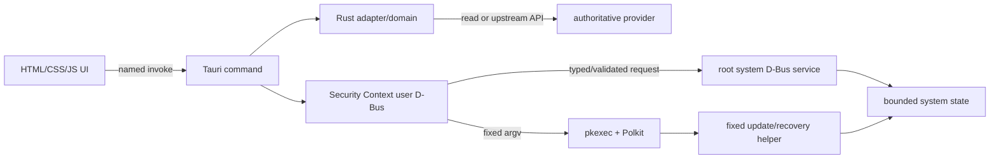

# GREYWARD privilege model

## Boundary

Security Center and its webview run as the logged-in user. The webview receives
only Tauri's `core:default` capability and can invoke the named commands
registered in `security-center/tauri/src-tauri/src/lib.rs`. It cannot invoke a
generic shell, submit arbitrary D-Bus calls, write arbitrary system files, or
run itself as root.

Authentication authorizes an attempt; it is not evidence of success. Mutation
paths must re-read provider state or return an explicit failure.

## Privileged interfaces

| Interface | Purpose and caller | Authorization | Accepted parameters | State affected | Failure behavior |
|---|---|---|---|---|---|
| `org.greyward.RecoveryPoint` / `/usr/libexec/greyward-recovery-point` | Tauri recovery commands create or clean local Btrfs points | `pkexec`, `auth_self`, invoking user must be in `wheel` | closed `create`/ `cleanup` operations and internally validated labels/IDs | GREYWARD Btrfs recovery subvolumes and metadata | denial/cancel/failure returns error; helper output is parsed and point validity checked |
| `org.greyward.Update1.apply` / `greyward-update-action` | Update Center user service applies the reviewed system plan | one `pkexec` `auth_self` prompt for a `wheel` user | validated operation ID; booleans for DNF5/system Flatpak/fwupd; bounded package-name list for detected drivers | DNF5 offline transaction, system Flatpaks, firmware, pre-update Btrfs point | provider events are streamed; invalid input is rejected; partial provider failure remains visible |
| `systems.mantis.greyward.SecureDns1` | Security Context reads state and requests mode/provider changes | system-bus policy: root owns name; mutation allowed to `wheel`; no per-action Polkit prompt | closed modes, closed provider IDs, no paths/commands | one selected systemd-resolved link and GREYWARD DNS policy/state files | ambiguous/VPN state is not globally overwritten; snapshot restore/fallback and explicit degraded state |
| `systems.mantis.greyward.OpenSnitchPolicy1` | Security Context lists and changes GREYWARD OpenSnitch policy | system-bus policy: root owns name; mutation allowed to `wheel`; no per-action Polkit prompt | JSON decoded into bounded app path, destination, port, action, duration, threat exception/settings | GREYWARD policy file consumed by control plane | schema/size/value rejection; atomic write; saved policy is not claimed active until observed |
| `systems.mantis.greyward.ClamAvScan1` | User service starts/cancels scans and coordinates detection lifecycle | reads are broadly available; mutation allowed to `wheel`; no per-action Polkit prompt | validated scan scope/path and bounded detection IDs; prepared quarantine/restore fields | scan processes, File Security database, quarantine transfer area | timeouts/cancellation are explicit; ownership and SHA-256 are checked across prepare/commit |
| NetworkManager/firewalld APIs | Rust backend changes the active connection's trust zone | upstream D-Bus and upstream Polkit | active connection identity and an installed zone enum | connection/firewall association | old/new state shown, result re-read, bounded undo when identity remains valid |
| Flatpak/portal APIs | user changes app override/profile or portal permission | user authority or upstream policy | app IDs and validated permission/profile fields | user Flatpak overrides and portal stores | unsupported schemas stay read-only; mutation is verified |
| USBGuard upstream APIs | Security Context reads devices/rules | local rule grants `wheel` read-only list actions | upstream list methods only | none | mutation remains governed by upstream USBGuard policy |

Restic backup operations are user-scoped and use a selected destination and
password supplied through fixed Zenity dialogs. They are consequential but not
root operations. File pickers and the software-center launcher are also fixed
local executables, not generic execution interfaces.

## Frontend restrictions

The frontend cannot:

- choose an executable or construct a shell command;
- submit raw nftables, firewalld, NetworkManager, USBGuard, SELinux, systemd, or
  crypto-policy text;
- call arbitrary bus names, objects, interfaces, or methods;
- bypass helper input validation;
- authorize a background privilege prompt;
- treat cached evidence as authorization;
- write root-owned policy or package state directly.

The Tauri layer does launch fixed programs for file/directory/password dialogs,
the packaged software center, and fixed update/recovery helpers. Arguments are
constructed by Rust; no shell is used.

## Review findings

### Group-gated root mutations

`SecureDns1`, `OpenSnitchPolicy1`, and `ClamAvScan1` rely on D-Bus policy
for `wheel` rather than a per-action Polkit decision. This is narrower than
public access and the methods validate payloads, but any process running as the
desktop's wheel user can call those mutation methods directly. Whether that is
the intended trust model deserves external review. Moving them to Polkit would
be an architectural change and was not done in this documentation pass.

### Opaque JSON envelopes

Several D-Bus methods carry JSON in a string signature. The receiving services
enforce schemas, bounds, closed enums, and IDs, but the bus signature itself
does not express those constraints. Reviewers should treat each decoder as part
of the privilege boundary. A future typed D-Bus schema could reduce this audit
surface.

### Command execution audit

The production paths use argument arrays with fixed executable names/paths.
No production `shell=True`, `os.system`, user-selected executable, or generic
`Execute`/file-write method was found. A `bash -c` occurrence exists in the
development-only privacy watchdog and is not installed as a production
privilege boundary.

## Reviewer map

- Tauri command registry: `security-center/tauri/src-tauri/src/lib.rs`
- Rust adapters/control: `security-center/crates/greyward-security-backends/src/`
- user-bus facade: `security-center/security-context/greyward_security_context/user_bus.py`
- root services: `secure_dns_reconciler.py`, `network_policy_service.py`,
  `clamav_service.py`
- update/recovery: `update_center_bus.py`, `bin/greyward-update-action`,
  `recovery.py`
- D-Bus policy: `security-center/security-context/dbus/`
- Polkit policy/rules: `security-center/security-context/polkit/`
- systemd confinement: `security-center/security-context/systemd/`
- boundary tests: `security-center/security-context/tests/test_service_hardening.py`,
  `test_update_center_bus.py`, `test_network_protection.py`, and
  `test_file_security.py`
